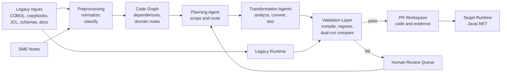

## What This Design Covers

This design covers a semi-autonomous modernization factory for one bounded legacy domain at a time. AI handles reverse engineering, documentation, decomposition, first-pass transformation, and test asset generation. Deterministic compilers, equivalence tests, and human signoff remain the release gate. The design assumes a hybrid target state because not every COBOL module should move at once. [S2][S3][S7][S8]

## Recommended Operating Model

| Decision Area | Recommendation |
|---------------|----------------|
| **Autonomy Model** | Use semi-autonomous execution. AI may analyze artifacts, propose code, and generate validation assets. Humans approve scope, resolve ambiguous rules, and authorize releases. [S3][S5][S7] |
| **System of Record** | The legacy codebase and outputs stay authoritative until the target passes compile, regression, and dual-run checks. [S2][S3][S5] |
| **Human Decision Points** | Architects choose retain, refactor, replatform, or redesign. SMEs validate undocumented rules. Release managers approve cutover after deterministic evidence is complete. [S2][S5][S7] |
| **Primary Value Driver** | The gain is faster understanding, mapping, and transformation of code handled by senior talent. [S1][S4][S8] |

## Architecture

### System Diagram

### Component Responsibilities

| Component | Role | Notes |
|-----------|------|-------|
| Preprocessing Layer | Normalizes source artifacts and translates comments where needed. | Context cleanup and chunking matter. [S6][S7] |
| Code Graph and Knowledge Store | Holds dependency maps, generated documentation, and unresolved ambiguities. | IBM and AWS both treat application understanding as a first-class stage. [S2][S3] |
| Planning Agent | Chooses modernization waves and routes units to retain, refactor, replatform, or redesign. | Surfaces non-functional boundaries. [S7] |
| Transformation Agents | Generate explanations, target-language code, and candidate tests from bounded context. | Microsoft's CAMF pattern uses specialized worker agents for this split. [S7] |
| Deterministic Validation Layer | Compiles code, runs tests, and compares outputs. | IBM and AWS both separate validation from generation. [S2][S5] |
| PR and Review Workspace | Packages code and evidence into a reviewable change set. | Needed for trust and release control. [S8][S13] |

## End-to-End Flow

| Step | What Happens | Owner |
|------|---------------|-------|
| 1 | Define one business-domain wave and verify artifact completeness before generation. | Architecture Team |
| 2 | Normalize source modules, copybooks, JCL, schemas, and legacy documentation into a bounded corpus. | Ingestion Pipeline [S6][S7] |
| 3 | Build the dependency graph and classify units as retain, refactor, replatform, or redesign. | Planning Agent [S3][S7] |
| 4 | Generate documentation, target-language code, and candidate tests for approved units. | Transformation Agents [S2][S7] |
| 5 | Compile, test, and dual-run compare. Route failures back for clarification or another pass. | Validation Layer [S2][S5] |
| 6 | Review the evidence bundle and keep the legacy runtime authoritative until cutover criteria are met. | SMEs + Release |

## AI Responsibilities and Boundaries

| Workflow Area | AI Does | Deterministic System Does | Human Owns |
|---------------|---------|---------------------------|------------|
| Application understanding | Extracts business rules, call chains, and data dependencies into readable artifacts. [S1][S2][S3] | Parses source files and validates artifact completeness. | Confirms extracted rules and missing context. |
| Domain decomposition | Proposes modernization units and wave sequencing. [S3][S7] | Enforces scope boundaries and lineage. | Accepts or rejects the proposed boundaries. |
| Code transformation | Produces first-pass Java or .NET code from bounded source context. [S2][S7] | Compiles code and blocks invalid outputs from promotion. | Resolves ambiguous transformations. |
| Test generation | Proposes regression cases and comparison logic. [S5][S7] | Executes golden tests and dual-run thresholds. | Curates the critical business scenarios. |
| Release governance | Summarizes risk, evidence, and unresolved gaps. | Creates audit logs and enforces PR-based change control. | Decides go or no-go for pilot and cutover. |

## Integration Seams

| System | Integration Method | Why It Matters |
|--------|--------------------|----------------|
| Source code and artifact export from z/OS | Repo mirror or managed ingestion of COBOL, copybooks, JCL, and supporting docs | The factory needs operational context. [S3][S7] |
| Transaction and batch orchestration | Read-only access to JCL flows, scheduler plans, and online transaction definitions | Much migration risk sits outside the COBOL statement itself. [S3][S5][S7] |
| Data layer | Schema export and sampled test data from Db2, VSAM, IMS DB, or downstream stores | Equivalence depends on representative data and record layouts. [S3][S5] |
| Build, test, and review toolchain | Git-based review workspace, compiler runners, and compare utilities | Generated code should ship through the normal delivery path. [S5][S13] |
| Hybrid runtime boundary | API wrappers, queues, and staged dual-run outputs | The first production boundary should assume coexistence. [S8] |

## Control Model

| Risk | Control |
|------|---------|
| Hallucinated or incomplete business logic enters the target code | Require source references, generated documentation, compile success, and curated functional tests before review. [S2][S5] |
| AI migrates code whose non-functional behavior is mainframe-specific | Route units with tight batch, I/O, or latency dependencies to redesign or retain decisions instead of forced conversion. Bankdata explicitly calls out this boundary. [S7] |
| Sensitive data leaks through prompts or generated artifacts | Use sanitized test extracts, scoped retrieval, and tenant-bound model access. [S5][S13] |
| Teams over-trust generated code and bypass review | Output only to review branches or artifact bundles. No automatic merge or deployment. [S3][S13] |
| Missing dependencies create false confidence | Block transformation when artifact inventory is incomplete. Dependency, scheduler, and schema checks happen before generation starts. [S3][S5] |
| Governance breaks across long-running programs | Version prompts, tools, and model configuration per wave and persist an evidence trail. [S8][S13] |

## Reference Technology Stack

| Layer | Default Choice | Reason | Viable Alternative |
|-------|----------------|--------|--------------------|
| **Model layer** | Azure OpenAI chat-completion model with tool calling inside an enterprise tenant boundary | Fits enterprise security controls and the Semantic Kernel pattern used in Microsoft's modernization reference. [S7][S11][S12] | IBM watsonx Code Assistant for Z or AWS Transform. [S2][S3] |
| **Orchestration** | Microsoft Semantic Kernel with a planner agent plus scoped plugins | Its plugin model maps cleanly to artifact lookup, validation, and writeback controls. [S7][S11][S12] | LangGraph or a custom runtime. |
| **Retrieval / memory** | Graph-backed code inventory plus markdown artifact store | Structured relationships help with call-chain depth and scheduler dependencies. [S3][S7] | Vector search over generated documentation for smaller estates. |
| **Target runtime** | Java 21 with Quarkus for replatformed services and batch workers | Java remains the common target, and Microsoft's reference factory targets Quarkus. [S7] | Spring Boot or .NET 8. |
| **Validation and observability** | Build pipeline plus equivalence comparator, dual-run reporting, and OpenTelemetry traces | Testing and comparison are the real production gate. [S5][S13] | Vendor-native tracing plus existing CI telemetry. |

## Key Design Decisions

| Decision | Choice | Why It Fits This Use Case |
|----------|--------|---------------------------|
| Scope shape | Modernize by bounded business domain, not by entire estate | Iterative hybrid modernization is the dominant pattern. [S8][S9][S10] |
| First AI objective | Prioritize understanding, documentation, and dependency mapping before code generation | IBM's strongest published results are in analysis speed. [S1][S2] |
| Release gate | Treat semantic equivalence and dual-run comparison as mandatory | AWS states testing typically consumes more than half of timelines and remains the primary confidence mechanism. [S5] |
| Mainframe exit strategy | Preserve hybrid coexistence until each domain proves out | Not every module should move immediately. [S8] |
| Human review model | Keep SMEs and architects on the high-ambiguity path, not in every loop | Human time is reserved for policy, edge cases, and cutover authority. [S3][S7][S13] |
