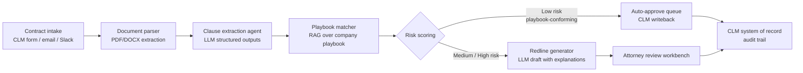

## What This Design Covers

This design covers the intake-to-redline path for corporate legal teams that already use a CLM platform but still rely on manual attorney review for every incoming contract. The reference pattern assumes a contract intake channel (CLM form, email, or Slack), a company negotiation playbook maintained by legal operations, and a CLM system such as Ironclad or DocuSign CLM as the system of record. The goal is to let AI handle clause extraction, playbook comparison, and redline generation while human attorneys stay in charge of risk acceptance, negotiation strategy, and non-standard escalations. [S1][S2][S4]

## Recommended Operating Model

| Decision Area | Recommendation |
|---------------|----------------|
| **Autonomy Model** | Tiered. Low-risk contracts that fully conform to the playbook can proceed with minimal human touch. Medium- and high-risk contracts route to attorneys with AI analysis pre-populated. [S2][S4] |
| **System of Record** | The CLM platform remains authoritative for contract status, approval chains, executed versions, and obligation tracking. [S8] |
| **Human Decision Points** | Attorneys review AI-flagged issues on non-standard contracts, approve risk acceptance for deviations, own counterparty negotiation strategy, and sign off on high-value deals. [S1][S2] |
| **Primary Value Driver** | Throughput gain comes from eliminating routine clause-by-clause reading, not from removing legal judgment. Attorneys shift from reading to deciding. [S2][S3][S6] |

## Architecture

### System Diagram

### Component Responsibilities

| Component | Role | Notes |
|-----------|------|-------|
| Document parser | Converts PDF, DOCX, and scanned contracts into structured text with section boundaries preserved. | Section-aware parsing is critical; clause boundaries in contracts do not follow standard paragraph rules. [S5] |
| Clause extraction agent | Identifies and classifies individual clauses (indemnity, limitation of liability, termination, IP assignment, etc.) with confidence scores. | Uses LLM structured outputs to produce a typed clause array. Production systems achieve 90-94% F1-scores on clause extraction. [S5][S7] |
| Playbook matcher | Compares each extracted clause against the company's negotiation playbook using RAG retrieval. | The playbook contains preferred positions, acceptable fallbacks, and hard limits per clause type. Legal ops maintains this without engineering support. [S3][S4] |
| Risk scorer | Assigns a risk level per clause and an overall contract risk score based on playbook deviations, missing clauses, and jurisdiction-specific requirements. | Deterministic rules handle bright-line thresholds (e.g., uncapped liability = high risk); the LLM handles language interpretation. [S4][S7] |
| Redline generator | Produces specific redline suggestions with plain-language explanations for each flagged clause. | Explanations must reference the playbook rule that was triggered so attorneys can evaluate the recommendation in context. [S2][S4] |
| Attorney review workbench | Presents the AI analysis, risk summary, and redline suggestions in a reviewable interface within the CLM. | Attorneys accept, modify, or reject each suggestion. Their decisions feed back into evaluation data. [S2][S8] |

## End-to-End Flow

| Step | What Happens | Owner |
|------|---------------|-------|
| 1 | A contract arrives via CLM intake, email, or Slack. The system classifies the contract type (NDA, MSA, vendor agreement, SOW) and extracts the document text. | Integration service [S8] |
| 2 | The clause extraction agent identifies individual clauses, classifies each by type, and outputs a structured clause array with confidence scores. | LLM with structured outputs [S5][S7] |
| 3 | The playbook matcher retrieves the relevant playbook rules for each clause type and compares the extracted language against preferred, acceptable, and unacceptable positions. | RAG retrieval + LLM comparison [S3][S4] |
| 4 | The risk scorer assigns per-clause and overall risk scores. Deterministic rules enforce bright-line thresholds; the LLM evaluates language nuance. | Scoring service [S4][S7] |
| 5 | Low-risk, playbook-conforming contracts enter the auto-approve queue with an AI summary attached. Medium/high-risk contracts get redline suggestions with explanations and route to the attorney workbench. | Routing logic + redline generator [S2][S4] |
| 6 | Attorneys review flagged contracts, accept or modify redlines, and return the contract to the business team. All decisions are logged to the CLM audit trail. | Attorneys + CLM [S1][S8] |

## AI Responsibilities and Boundaries

| Workflow Area | AI Does | Deterministic System Does | Human Owns |
|---------------|---------|---------------------------|------------|
| Document intake | Extracts text, identifies contract type, detects language and jurisdiction cues. [S5] | Validates file format, enforces size limits, routes to correct queue. | Resolves unreadable or incomplete documents. |
| Clause analysis | Extracts and classifies clauses, scores confidence, identifies missing standard clauses. [S5][S7] | Enforces clause taxonomy schema, rejects malformed extraction output. | Reviews low-confidence extractions and novel clause types. |
| Playbook comparison | Compares clause language to playbook positions, identifies deviations, explains the nature of each deviation. [S3][S4] | Retrieves playbook rules from the vector store, applies version control. | Maintains playbook content, approves playbook changes. |
| Risk scoring and redlining | Generates risk scores for nuanced language, drafts redline suggestions with explanations. [S2][S4] | Enforces bright-line rules (uncapped liability, unlimited indemnity), applies contract-value thresholds. | Accepts or rejects risk, decides negotiation strategy, signs off on deviations. |

## Integration Seams

| System | Integration Method | Why It Matters |
|--------|--------------------|----------------|
| CLM platform (Ironclad, DocuSign CLM) | REST API for contract retrieval, status updates, and annotation writeback | The CLM holds the contract lifecycle state; the AI system must read from and write back to it. [S8] |
| Company playbook repository | Vector store with versioned playbook documents, indexed by clause type and jurisdiction | Playbook retrieval quality directly determines review accuracy. Must support updates by legal ops without redeployment. [S3][S4] |
| Document storage (SharePoint, Google Drive) | File API for retrieving contract documents referenced in intake requests | Contracts often arrive as attachments or links; the system must handle both paths. |
| Matter management / legal spend | API or webhook for logging review effort and tracking contract throughput | Provides the data needed to measure ROI and identify bottleneck patterns. |

## Control Model

| Risk | Control |
|------|---------|
| Clause misclassification or missed clause | Maintain a golden test set of annotated contracts; block deployment if F1-score drops below 90% on any clause category. [S5][S7] |
| Hallucinated playbook rule | Ground all playbook comparisons in RAG retrieval with source citations; never let the model invent a playbook position from parametric knowledge. [S3] |
| Over-automation of risk acceptance | Limit auto-approve to contracts below a value threshold that score low-risk across all clause categories; require attorney sign-off for everything else. [S1][S2] |
| Confidentiality of contract content | Run the model in a private deployment (Azure OpenAI or Anthropic private endpoint) with a contractual do-not-train provision. [S4][S9] |
| Audit and compliance gaps | Log every extraction, playbook comparison, risk score, and attorney decision with timestamps and model version. Persist source documents alongside AI outputs. [S1][S8] |

## Reference Technology Stack

| Layer | Default Choice | Reason | Viable Alternative |
|-------|----------------|--------|--------------------|
| **Model layer** | Claude Sonnet 4.6 with structured outputs | Strong performance on legal language comprehension, native structured output support, 200K context handles long contracts. [S9] | Azure OpenAI GPT-4o for teams standardized on Azure. |
| **Document understanding** | Direct LLM extraction from parsed text | Commercial contracts are predominantly digital-native (DOCX/PDF with text layers); OCR is rarely needed. [S5] | Azure Document Intelligence for scanned legacy contracts. |
| **Retrieval / playbook** | Vector store (PostgreSQL pgvector or Pinecone) with playbook chunks indexed by clause type | Playbook retrieval must be fast, version-controlled, and updatable by legal ops. | Embedded retrieval in a framework like LlamaIndex. |
| **Orchestration** | LangGraph | Graph-based workflow with explicit branching for risk tiers; clean separation between extraction, matching, scoring, and redlining nodes. | Semantic Kernel for .NET-centric legal tech teams. |

## Key Design Decisions

| Decision | Choice | Why It Fits This Use Case |
|----------|--------|---------------------------|
| Clause-level extraction before comparison | Extract and classify individual clauses first, then compare each against the playbook separately | Contract review is inherently clause-level work. Whole-document comparison misses the specificity attorneys need. [S5][S7] |
| RAG-grounded playbook matching | Retrieve playbook rules via vector search rather than encoding them in the prompt | Playbooks change frequently and vary by contract type and jurisdiction. RAG keeps the system current without redeployment. [S3][S4] |
| Tiered autonomy by risk score | Auto-approve low-risk contracts; pre-populate analysis for medium/high-risk | Matches the real workflow: most NDAs are routine, most MSAs need attorney eyes. The tiering must be configurable per contract type. [S1][S2] |
| Redlines with explanations | Every suggested redline includes a plain-language explanation citing the specific playbook rule | Attorneys reject opaque suggestions. Explanations build trust and let reviewers evaluate quickly without re-reading the playbook. [S2][S4] |
