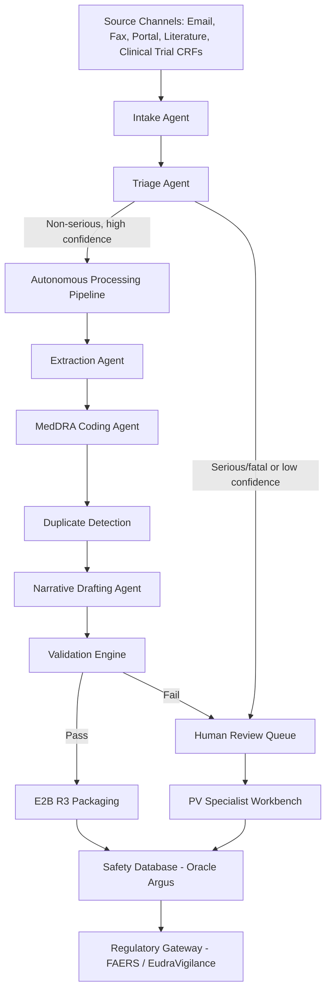

## What This Design Covers

This design addresses the end-to-end processing of Individual Case Safety Reports (ICSRs) from intake through regulatory submission. The recommended operating model uses agentic AI to autonomously handle routine non-serious cases while routing serious, fatal, and complex cases through human review. The design boundary covers intake, triage, data extraction, MedDRA coding, duplicate detection, narrative drafting, and E2B(R3) packaging — but excludes aggregate signal management and benefit-risk committee decisions.

## Recommended Operating Model

| Decision Area | Recommendation |
|---------------|----------------|
| **Autonomy Model** | Tiered: fully autonomous for non-serious cases that pass confidence thresholds; human-in-the-loop for serious/fatal cases and low-confidence extractions |
| **System of Record** | Safety database (Oracle Argus Safety or equivalent) remains authoritative for all case data and submission history |
| **Human Decision Points** | Causality assessment for serious cases, seriousness upgrade decisions, final QC on expedited reports, and signal escalation |
| **Primary Value Driver** | Throughput: reducing 2–4 hour manual processing to under 30 minutes per routine case while maintaining regulatory-grade accuracy |

## Architecture

### System Diagram

### Component Responsibilities

| Component | Role | Notes |
|-----------|------|-------|
| Intake Agent | Ingests source documents from all channels, performs OCR/speech-to-text, normalizes to structured intake record | Handles PDF, email, audio, HL7 FHIR messages |
| Triage Agent | Classifies seriousness, identifies product, determines reportability and regulatory deadline | Applies ICH E2A seriousness criteria deterministically after LLM extraction |
| Extraction Agent | Extracts patient demographics, suspect drug, concomitant medications, event terms, dates, outcomes, reporter details | LLM with structured output schema validated against E2B(R3) field requirements |
| MedDRA Coding Agent | Maps verbatim adverse event terms to MedDRA Preferred Terms and Lowest Level Terms | Retrieval-augmented against MedDRA dictionary; falls back to human when confidence < 0.85 |
| Duplicate Detection | Identifies potential duplicate or follow-up reports for the same case | Deterministic matching on patient ID, event dates, reporter; fuzzy LLM matching for unlabeled follow-ups |
| Narrative Drafting Agent | Produces clinical narrative summary per regulatory conventions | Grounded exclusively in extracted case data; no hallucinated clinical detail |
| Validation Engine | Runs deterministic business rules against E2B(R3) schema completeness | Rule engine, not AI — ensures mandatory fields populated, dates logical, codes valid |
| Safety Database | Stores final case record, manages case lifecycle, tracks submission status | Oracle Argus Safety or equivalent with E2B(R3) export capability |

## End-to-End Flow

| Step | What Happens | Owner |
|------|---------------|-------|
| 1 | Source document arrives (email, portal upload, literature alert, clinical trial CRF) and Intake Agent normalizes it to machine-readable text | Intake Agent |
| 2 | Triage Agent classifies seriousness, identifies product and reporter, sets regulatory deadline, and routes case | Triage Agent |
| 3 | Extraction Agent pulls all ICSR fields into structured format; MedDRA Coding Agent assigns medical terminology codes | AI Pipeline |
| 4 | Duplicate Detection checks against existing cases; flags potential matches for merge or follow-up processing | Deterministic + AI |
| 5 | Narrative Drafting Agent writes clinical narrative; Validation Engine checks E2B(R3) completeness | AI + Rule Engine |
| 6 | For autonomous-path cases: packaged and submitted. For flagged cases: routed to PV specialist for review, correction, and approval | System / Human |

## AI Responsibilities and Boundaries

| Workflow Area | AI Does | Deterministic System Does | Human Owns |
|---------------|---------|---------------------------|------------|
| Intake and OCR | Document parsing, entity recognition, source channel routing | Format validation, attachment handling, acknowledgment | Source quality escalation |
| Triage and classification | Seriousness assessment, product identification, deadline assignment | Regulatory rule application (7/15-day logic), SLA tracking | Seriousness upgrades, ambiguous reportability |
| Medical coding | MedDRA term suggestion with confidence score | Dictionary lookup validation, code hierarchy verification | Final coding decision when confidence < 0.85 |
| Narrative generation | Draft clinical narrative from extracted data | Template compliance check, length validation | Medical accuracy review on serious cases |
| Causality assessment | Preliminary causality scoring for non-serious cases | WHO-UMC algorithm application | Final causality determination on serious/fatal cases |

## Integration Seams

| System | Integration Method | Why It Matters |
|--------|--------------------|----------------|
| Oracle Argus Safety (or equivalent safety DB) | REST API + PL/SQL stored procedures | System of record for all case data; submission gateway depends on it |
| MedDRA Browser/Dictionary | File-based dictionary load + API lookup | Medical coding accuracy depends on current MedDRA version (updated biannually) |
| FDA FAERS / EMA EudraVigilance | E2B(R3) XML via ESTRI gateway / EV Web Services | Regulatory submission is the terminal output; must comply with ICH E2B(R3) as of April 2026 |
| Document Management (intake sources) | IMAP/SMTP for email, REST API for portals, sFTP for literature feeds | Multi-channel intake requires adapters per source type |
| Clinical Trial Management System (CTMS) | HL7 FHIR or proprietary API | Trial-sourced AEs need protocol context and unblinding rules |

## Control Model

| Risk | Control |
|------|---------|
| Incorrect seriousness classification leading to missed expedited deadline | Dual-path validation: LLM classifies, then deterministic rule engine re-checks against ICH E2A criteria; any mismatch routes to human |
| MedDRA miscoding producing wrong safety signal | Confidence threshold (0.85) gates autonomous coding; all coding below threshold requires human confirmation; periodic audit sampling at 5% |
| Narrative hallucination adding clinical details not in source | Narrative agent prompt constrained to extracted fields only; post-generation grounding check compares narrative assertions against source extraction |
| Duplicate missed causing regulatory over-reporting | Multi-stage matching: deterministic on known identifiers, then LLM semantic matching on reporter/patient description; human confirms all merge decisions |
| Data privacy breach exposing patient information | PII redaction at intake; processing in isolated tenant; audit logging on all data access; GDPR Article 9 safeguards for health data |

## Reference Technology Stack

| Layer | Default Choice | Reason | Viable Alternative |
|-------|----------------|--------|--------------------|
| **Model layer** | Claude (Anthropic) via API | Strong structured output, long context for multi-page source documents, safety-oriented design | GPT-4o (OpenAI), Gemini Pro (Google) |
| **Orchestration** | LangGraph (multi-agent) | Graph-based workflow fits the sequential-with-branching ICSR pipeline; supports human-in-the-loop nodes | CrewAI, custom state machine |
| **Retrieval / memory** | Vector store (pgvector) + MedDRA dictionary index | MedDRA coding requires retrieval; case history needed for duplicate detection | Pinecone, Weaviate |
| **Safety database** | Oracle Argus Safety | Industry standard; E2B(R3) export built in; regulatory gateway pre-certified | Veeva Vault Safety, ArisGlobal LifeSphere |
| **Observability** | LangSmith + application logging | Trace every agent decision for GxP audit trail; latency monitoring for deadline compliance | Datadog, custom GxP audit logger |

## Key Design Decisions

| Decision | Choice | Why It Fits This Use Case |
|----------|--------|---------------------------|
| Tiered autonomy rather than full automation | Non-serious cases autonomous; serious cases human-reviewed | Regulatory risk of missed serious case is catastrophic (warning letters, market withdrawal); non-serious cases are high-volume and lower risk |
| Deterministic validation after every AI step | Rule engine re-checks AI outputs against E2B(R3) schema and business rules | GxP environment requires demonstrable accuracy; AI confidence alone insufficient for regulated submission |
| MedDRA retrieval-augmented coding rather than fine-tuned model | RAG against versioned MedDRA dictionary | MedDRA updates biannually; RAG avoids retraining and ensures current terminology without model drift |
| Separate narrative agent with grounding constraint | Narrative generated only from extracted structured data, never from raw source directly | Prevents hallucination of clinical details; makes audit trail clear (extracted fact → narrative sentence) |
| Oracle Argus as system of record (not AI platform) | AI pipeline writes to Argus; Argus owns submission lifecycle | Leverages existing regulatory certifications and gateway connections; avoids rebuilding submission infrastructure |
