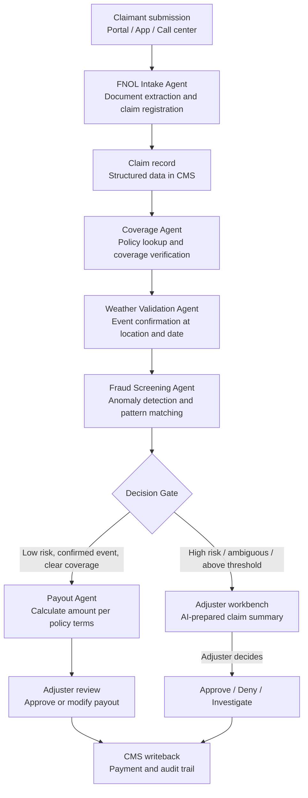

## What This Design Covers

This design covers the first-notice-of-loss (FNOL) to payout-ready path for low-complexity, high-frequency property and casualty claims — specifically catastrophe-related claims under a defined threshold (e.g., AUD $500 food spoilage from storm power outages). The recommended operating model uses a multi-agent architecture where specialized AI agents handle policy verification, weather event validation, fraud screening, and payout calculation. Agents prepare claims for human adjuster decision; they never authorize payments autonomously. The design is modeled on Allianz's Project Nemo deployment, which reduced processing time by 80% using seven specialized agents. [S1]

## Recommended Operating Model

| Decision Area | Recommendation |
|---------------|----------------|
| **Autonomy Model** | Human-on-the-loop. Agents process claims end-to-end and present a recommendation with supporting evidence. Human adjusters approve, modify, or reject. For pre-approved low-value thresholds, auto-approval may be enabled after pilot validation. [S1][S5] |
| **System of Record** | The claims management system (Guidewire ClaimCenter or equivalent) remains authoritative for claim status, payments, and reserves. [S10] |
| **Human Decision Points** | Adjusters review every payout recommendation during pilot. Post-pilot, adjusters review escalated claims (high value, fraud flags, ambiguous coverage). Compliance owns model governance and bias audits. [S8] |
| **Primary Value Driver** | Cycle time compression from 4+ days to same-day on eligible claims during catastrophe surges. Secondary: consistent fraud screening and reduced loss-adjusting expenses (20–25% at scale). [S1][S5] |

## Architecture

### System Diagram

### Component Responsibilities

| Component | Role | Notes |
|-----------|------|-------|
| FNOL Intake Agent | Extracts structured claim data from submission documents, classifies claim type, and creates the claim record in the CMS. | Handles photos, receipts, written descriptions. Uses LLM extraction with structured output for consistent field mapping. [S1][S6] |
| Coverage Agent | Looks up the claimant's policy, verifies the event type is covered, checks deductibles, and confirms the claim falls within policy limits. | Deterministic policy rules engine handles coverage logic; LLM interprets policy language for edge cases. [S1] |
| Weather Validation Agent | Cross-references the claimed event (storm, hail, flood) against weather data for the specific location and date. | Calls weather APIs (Meteomatics, BOM, NOAA) to confirm or deny the reported event occurred. Returns binary confirmation plus severity data. [S1] |
| Fraud Screening Agent | Scores the claim for fraud indicators using pattern matching, network analysis, and anomaly detection. | Combines rule-based checks (duplicate claims, velocity) with ML anomaly detection. Flags but never blocks — human reviews all flags. [S2][S6] |
| Payout Agent | Calculates the recommended payout amount based on policy terms, deductibles, depreciation, and supporting documentation. | Deterministic calculation engine; AI assists with receipt validation and item categorization. [S1] |
| Decision Gate | Routes claims based on fraud score, coverage confidence, weather confirmation, and claim value. | Configurable thresholds: claim amount, fraud score, coverage ambiguity, missing documentation. |

## End-to-End Flow

| Step | What Happens | Owner |
|------|---------------|-------|
| 1 | Claimant submits claim via portal, app, or call center. FNOL Intake Agent extracts structured data from documents, photos, and descriptions. Claim record created in CMS. | FNOL Intake Agent |
| 2 | Coverage Agent retrieves the claimant's policy, verifies the event type is a covered peril, checks deductible, and confirms claim is within policy limits. | Coverage Agent |
| 3 | Weather Validation Agent queries weather data services for the claimed location and date. Confirms whether the reported weather event (storm, power outage) actually occurred. | Weather Validation Agent |
| 4 | Fraud Screening Agent scores the claim using duplicate detection, velocity checks, network analysis, and anomaly scoring. Returns a risk level and any flags. | Fraud Screening Agent |
| 5 | Decision Gate evaluates all agent outputs. Low-risk claims with confirmed weather and clear coverage proceed to payout calculation. Others route to adjuster workbench. | Decision Gate (deterministic rules) |
| 6 | Payout Agent calculates recommended amount. Adjuster reviews the complete claim package (extraction, coverage, weather, fraud, payout) and approves, modifies, or rejects. | Payout Agent + Human Adjuster |
| 7 | Decision, evidence chain, and all agent outputs logged to CMS and audit system. Payment triggered on approval. | CMS and audit trail |

## AI Responsibilities and Boundaries

| Workflow Area | AI Does | Deterministic System Does | Human Owns |
|---------------|---------|---------------------------|------------|
| Claim intake | Extracts fields from unstructured documents, classifies claim type, identifies missing information, and flags low-confidence extractions. [S6] | Validates extracted data against required-field rules and policy schema. Creates claim record in CMS. | Reviews extraction failures and ambiguous submissions. |
| Coverage verification | Interprets policy language for complex coverage questions. Summarizes relevant policy sections for the adjuster. [S1] | Applies coverage rules engine: covered perils, deductible amounts, sub-limits, exclusions. | Decides coverage on ambiguous or disputed claims. |
| Weather validation | Orchestrates weather API calls and correlates location/date/event type against meteorological records. [S1] | Enforces geo-fencing rules (claim location must be within declared catastrophe zone). | Reviews claims where weather data is inconclusive or unavailable. |
| Fraud screening | Scores anomaly risk using ML models. Detects patterns (duplicate claims, suspicious timing, network clusters). [S2][S6] | Applies hard fraud rules (known fraud lists, velocity limits, duplicate detection). | Makes all fraud determination decisions. AI flags; humans decide. |
| Payout calculation | Categorizes receipts and items. Applies depreciation schedules. Calculates recommended amount. [S1] | Enforces policy limits, deductibles, and co-insurance as hard constraints. | Approves every payout. Modifies amounts when AI recommendation is incorrect. |

## Integration Seams

| System | Integration Method | Why It Matters |
|--------|--------------------|----------------|
| Claims management system (Guidewire ClaimCenter) | REST API (Guidewire Cloud API v1) | System of record for claims, payments, and reserves. All agent outputs write back here. Claim lifecycle managed through CMS endpoints. [S10] |
| Weather data services (Meteomatics, BOM, NOAA) | REST APIs with provider-specific authentication | Weather confirmation is the critical evidence gate for catastrophe claims. Multiple providers needed for coverage across geographies. |
| Fraud detection platform (Shift Technology or equivalent) | REST API or event-driven integration | Purpose-built fraud models trained on insurance-specific patterns outperform general anomaly detection. Integration enables real-time scoring. [S6] |
| Policy administration system | REST API or database view | Coverage Agent needs real-time policy data: covered perils, limits, deductibles, endorsements, and policy status. |
| Document storage / content management | Object storage API (S3-compatible) | Claims include photos, receipts, and correspondence that agents must retrieve and analyze. |
| ACORD data exchange | XML/JSON schema parsing per ACORD standards | Structured submissions from brokers or partner systems bypass LLM extraction and go directly to schema validation. |

## Control Model

| Risk | Control |
|------|---------|
| Extraction error from photos or handwritten receipts | Confidence scoring per extracted field; fields below 0.7 confidence flag for human review before downstream agents proceed. Schema validation against required claim fields. |
| Weather data unavailable or inconclusive | Fallback to manual weather verification queue. Claim routes to adjuster if weather confirmation cannot be obtained within SLA. Multiple weather providers for redundancy. |
| False-negative fraud screening (missed fraud) | Combine ML anomaly detection with deterministic rule checks. Post-payment audit sampling on auto-approved claims. Network analysis for organized fraud rings. [S6] |
| False-positive fraud screening (wrongful denial) | AI flags but never blocks. All fraud flags reviewed by human adjuster before any denial. Tracking of flag override rates to tune model. |
| Regulatory non-compliance (AI decision-making) | Human adjuster approves every payout decision. Full audit trail of agent reasoning. Comply with NAIC Model Bulletin requirements for AI program documentation. [S8] |
| Payout calculation error | Deterministic calculation engine enforces policy limits and deductibles. AI assists with item categorization but does not override policy arithmetic. |

## Reference Technology Stack

| Layer | Default Choice | Reason | Viable Alternative |
|-------|----------------|--------|--------------------|
| **Model layer** | Claude for document extraction and claim summarization; XGBoost for fraud scoring | LLM handles unstructured document variety (photos, receipts, descriptions). Supervised ML is more interpretable for fraud scoring in a regulated context. [S6] | GPT-4 for extraction; Shift Technology for purpose-built fraud models. |
| **Orchestration** | LangGraph with state machine routing | Claims processing needs sequential agent execution with conditional routing, retry logic, and human-in-the-loop support at the decision gate. | Temporal for durable execution; Orkes Conductor for enterprise workflow. |
| **Retrieval / memory** | Vector store for policy documents and claims history lookup | Coverage Agent needs to reference policy wordings. Fraud Agent benefits from historical claims similarity search. | Full-text search if policy corpus is small. |
| **Observability** | OpenTelemetry traces per claim; structured decision logs | Every processed claim must have a traceable audit path from submission through payout recommendation. Regulatory requirement under NAIC Model Bulletin. [S8] | Datadog or Splunk for carriers with existing observability stacks. |

## Key Design Decisions

| Decision | Choice | Why It Fits This Use Case |
|----------|--------|---------------------------|
| Sequential agent pipeline, not parallel | Agents execute in order: intake → coverage → weather → fraud → payout | Each agent's output feeds the next. Coverage must be confirmed before weather check is meaningful. Fraud scoring needs all prior context. Matches Allianz Project Nemo's architecture. [S1] |
| Human approves every payout in pilot | No auto-approval until pilot KPIs are met | Regulatory requirement in most jurisdictions. Builds adjuster trust. Provides labeled data for model improvement. [S8] |
| Weather validation as a first-class agent | Dedicated agent with multi-provider weather API access | For catastrophe claims, weather confirmation is the strongest evidence of legitimate loss. Automates the most time-consuming manual verification step. [S1] |
| Fraud flags, not fraud decisions | AI scores risk but never denies a claim | Prevents wrongful denial liability. Maintains human accountability for adverse decisions. Aligns with NAIC requirements for human oversight of AI. [S8] |
| Start with low-complexity claims only | Scope to sub-$500 catastrophe claims (food spoilage, minor property) | Highest volume, lowest risk, fastest ROI. Proves the pipeline before expanding to complex claims. Matches Allianz's phased approach. [S1][S5] |
