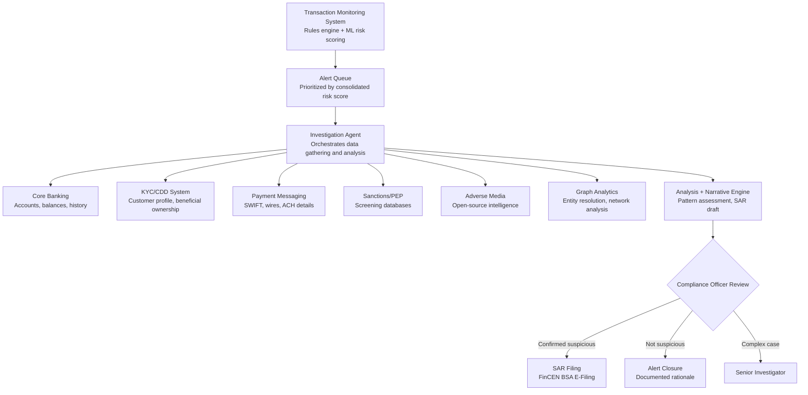

## What This Design Covers

This design covers the alert-to-disposition path for AML transaction monitoring alerts at a mid-to-large bank. The recommended operating model uses agentic AI to investigate alerts autonomously — gathering context from 6–12 siloed systems, scoring risk, performing network analysis, and drafting SAR-quality narratives — while compliance officers retain sign-off authority on every escalation and filing decision. The design boundary starts at the point an alert leaves the transaction monitoring system and ends when the case is either closed with documented rationale or filed as a SAR through FinCEN's BSA E-Filing System.

## Recommended Operating Model

| Decision Area | Recommendation |
|---------------|----------------|
| **Autonomy Model** | Human-on-the-loop. The investigation agent gathers evidence, scores risk, and drafts narratives autonomously. Compliance officers review every recommended disposition. No SAR is filed or alert closed without human sign-off. [S1][S6] |
| **System of Record** | The existing case management system (Actimize, Verafin, or equivalent) remains authoritative for alert status, investigation notes, SAR filings, and audit trail. [S12][S15] |
| **Human Decision Points** | L2 analysts review AI-prepared investigation packages. BSA officers approve every SAR filing. Senior investigators handle complex cases the agent flags as low-confidence. Compliance owns model governance under SR 11-7. [S10] |
| **Primary Value Driver** | Investigation time compression from 4–22 hours to under 30 minutes per alert, enabling the same analyst team to handle 3–5x more cases. Secondary: consistent evidence gathering eliminates the variability of manual system-hopping. [S1][S6] |

## Architecture

### System Diagram

### Component Responsibilities

| Component | Role | Notes |
|-----------|------|-------|
| Transaction Monitoring System | Generates alerts from rules-based scenarios and ML anomaly detection. Provides initial alert context (triggering transactions, scenario, customer ID). | Existing system; not replaced. AI augments downstream investigation, not alert generation. Google Cloud AML AI or similar ML overlay can reduce alert volume 60%+ before investigation begins. [S1][S2] |
| Investigation Agent | Orchestrates data retrieval across all source systems, assembles a unified investigation package, scores risk, and drafts a structured narrative. | Core agentic component. Each investigation is a stateful workflow with tool calls to each source system. Handles retry, timeout, and missing-data fallback. |
| Graph Analytics Engine | Resolves entities across systems, maps financial relationships, traces multi-hop fund flows, and identifies network patterns (layering, circular flows, shell structures). | Quantexa, TigerGraph, or Neo4j. Critical for detecting organized crime patterns that table-based analysis misses. [S7][S14] |
| Narrative Generator | Produces SAR-quality narrative covering the five W's (who, what, when, where, why) with inline citations to source data. | LLM-based with structured output constraints. Every claim in the narrative links to a retrieved data point. [S3][S6] |
| Compliance Officer Workbench | Presents the AI-prepared investigation package for human review. Officers approve, modify, or reject the recommended disposition. | Existing case management UI, extended with AI summary view. Full audit trail of agent reasoning and officer decisions. |

## End-to-End Flow

| Step | What Happens | Owner |
|------|---------------|-------|
| 1 | TMS generates alert with triggering transactions, scenario type, and customer identifier. ML risk scoring layer (if deployed) assigns a consolidated customer risk score and prioritizes the queue. | TMS + ML scoring layer |
| 2 | Investigation agent receives the alert and executes parallel tool calls to retrieve customer profile (KYC/CDD), transaction history (core banking), payment details (SWIFT/ACH), sanctions/PEP screening results, adverse media hits, and prior SAR history. | Investigation Agent |
| 3 | Graph analytics engine resolves entities across data sources, maps the customer's financial network, and identifies structural risk patterns (circular flows, shell company connections, unusually complex ownership). | Graph Analytics Engine |
| 4 | Agent synthesizes all gathered evidence, scores the investigation against typology indicators, and drafts a structured narrative covering the five W's required for SAR filing. Low-confidence cases are flagged for senior review. | Investigation Agent + Narrative Generator |
| 5 | Compliance officer reviews the complete investigation package — evidence summary, network diagram, risk score, and draft narrative. Officer approves filing, requests additional investigation, or closes the alert with documented rationale. | Compliance Officer |
| 6 | Approved SARs are filed through BSA E-Filing. All investigation artifacts, agent reasoning traces, and officer decisions are persisted to the case management system for audit. | Case Management System |

## AI Responsibilities and Boundaries

| Workflow Area | AI Does | Deterministic System Does | Human Owns |
|---------------|---------|---------------------------|------------|
| Alert prioritization | Scores customer risk using ML models on transactional patterns and behavioral signals. Ranks the investigation queue by risk severity. [S1][S2] | TMS applies rules-based scenario thresholds. Sanctions screening runs exact-match and fuzzy-match against OFAC/EU/UN lists. | Reviews prioritization overrides. Adjusts scoring model parameters during periodic tuning. |
| Evidence gathering | Orchestrates parallel retrieval from 6–12 source systems. Handles missing data gracefully — documents what was unavailable rather than inferring. | APIs enforce access controls and rate limits. Data lake provides normalized transaction feeds. | Reviews cases where critical data sources were unavailable. |
| Network analysis | Runs entity resolution and multi-hop fund flow tracing. Identifies structural patterns consistent with money laundering typologies. [S7] | Graph database enforces schema and data integrity. Deterministic rules flag sanctions matches. | Interprets network findings in business context. Decides whether patterns constitute genuine suspicion. |
| Narrative generation | Drafts SAR narrative covering who, what, when, where, why with inline source citations. Identifies gaps in the evidence. [S3][S6] | Template engine enforces required SAR fields. Validation rejects narratives with blank critical fields. | Edits, approves, or rewrites every narrative before filing. Signs the SAR. |
| Disposition recommendation | Recommends file-SAR, close-with-rationale, or escalate-to-senior. Provides confidence score. | Case management enforces workflow state transitions and SLA timers. | Makes every final disposition decision. No alert is closed or filed without human sign-off. |

## Integration Seams

| System | Integration Method | Why It Matters |
|--------|--------------------|----------------|
| Core banking platform | REST API or database view (read-only) | Transaction history and account data form the factual backbone of every investigation. Real-time access needed for current balances and recent activity. |
| KYC/CDD system | REST API | Customer due diligence data, beneficial ownership structures, and risk ratings are essential for context. Investigation agent must retrieve the current CDD profile, not a stale cache. |
| SWIFT / payment messaging | API or message queue (read-only) | Cross-border wire details, originator/beneficiary information, and correspondent bank chains. Critical for international fund flow tracing. |
| Sanctions and PEP screening | REST API | Real-time screening results against OFAC SDN, EU consolidated list, UN sanctions, and PEP databases. Agent consumes screening hits as investigation input. |
| Case management system | REST API (read-write) | System of record for investigation status, narrative, evidence attachments, and SAR filing. Agent writes investigation packages; officers write disposition decisions. |
| Graph analytics platform | API or embedded query engine | Entity resolution and network traversal results. Agent submits entity identifiers and receives resolved networks, risk scores, and pattern matches. [S7][S14] |

## Control Model

| Risk | Control |
|------|---------|
| Hallucinated evidence in narrative | Every claim in the generated narrative must cite a specific data retrieval result. Structured output schema enforces inline source references. Narratives failing citation validation are blocked from officer review. [S3] |
| Missed suspicious activity (false negative) | Dual-path detection: rules-based TMS plus ML scoring. Agent investigation adds a third analytical layer. Post-disposition sampling audits a percentage of closed alerts. [S1][S2] |
| Model drift degrading risk scores | SR 11-7 model risk management: quarterly back-testing against labeled outcomes, annual independent validation, model inventory with risk ratings. [S10] |
| Data access beyond investigation scope | Tool-level access scoping: each tool call is parameterized to the alert's customer and counterparties only. No broad database queries. Audit log captures every data retrieval. |
| Regulatory non-compliance | Human signs every SAR. Full audit trail from alert through disposition. Agent reasoning traces stored for examination. Complies with FinCEN filing requirements and EU AMLR record-keeping obligations. [S3][S8] |
| Adversarial manipulation of AI | Input validation on all retrieved data. Agent does not accept external instructions embedded in customer data fields. Prompt injection defenses on all LLM inputs. |

## Reference Technology Stack

| Layer | Default Choice | Reason | Viable Alternative |
|-------|----------------|--------|--------------------|
| **Model layer** | Claude for narrative generation and evidence synthesis; XGBoost/LightGBM for transaction risk scoring | LLM handles unstructured evidence synthesis and SAR narrative drafting. Supervised ML is more interpretable and auditable for risk scoring in a regulated context. [S10][S11] | GPT-4o for narrative; Google Cloud AML AI for consolidated risk scoring. [S2] |
| **Orchestration** | LangGraph with durable state | Investigation workflows need stateful multi-step execution with parallel tool calls, conditional routing, retry logic, and human-in-the-loop gates. | Temporal for durable execution; Orkes Conductor for enterprise workflow. |
| **Graph analytics** | Quantexa Decision Intelligence or Neo4j | Entity resolution across siloed systems and multi-hop fund flow tracing are core to investigation quality. Quantexa has named deployments at Danske Bank and Standard Chartered. [S7][S14] | TigerGraph; Amazon Neptune for AWS-native environments. |
| **Observability** | OpenTelemetry traces per investigation; structured decision logs | Every investigation must have a traceable audit path from alert through disposition. Regulatory requirement under SR 11-7 and BSA examination procedures. [S10] | Datadog or Splunk for banks with existing observability stacks. |

## Key Design Decisions

| Decision | Choice | Why It Fits This Use Case |
|----------|--------|---------------------------|
| AI investigates but never disposes | Human compliance officer approves every SAR filing and alert closure | Regulatory requirement (FinCEN, EU AMLR). Personal liability for BSA officers. Builds examiner confidence. Dutch bunq ruling supports AI use but does not remove human accountability. [S3][S8][S11] |
| Consolidated customer risk scoring over per-transaction alerts | ML scores the customer holistically, not each transaction in isolation | HSBC's deployment showed 2–4x more genuine suspicious activity detected with this approach, while reducing alert volume by 60%+. Per-transaction rules miss behavioral patterns. [S1][S2] |
| Graph analytics as a first-class component | Dedicated entity resolution and network analysis, not just tabular joins | Money laundering schemes involve multi-entity networks that table-based systems miss. Danske Bank achieved 60% false positive reduction with graph-based approach. [S7] |
| SAR narrative grounded retrieval, not free generation | Every narrative sentence must cite a specific data retrieval result | Eliminates hallucination risk in a document that becomes a federal filing. Builds examiner trust in AI-assisted investigations. [S3] |
| Start with L1 alert triage, expand to L2 investigation | Phase 1 handles high-volume, lower-complexity L1 triage; Phase 2 adds full L2 investigation | L1 triage is highest volume (200K–500K alerts/year) with 90–95% false positives. Fastest ROI and lowest risk starting point. Matches HSBC's phased deployment across markets. [S1] |
