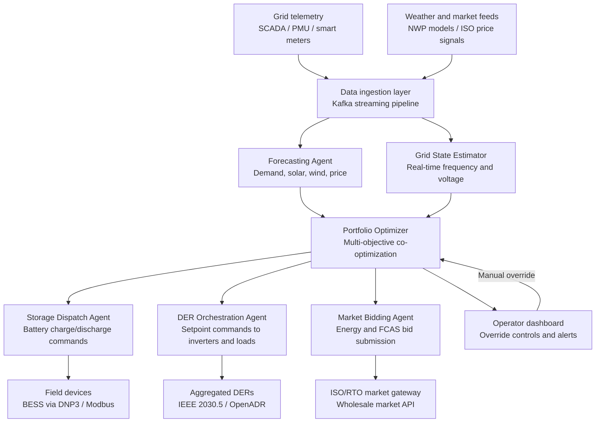

## What This Design Covers

This design covers real-time grid balancing, distributed energy resource (DER) orchestration, and wholesale market participation for a utility or independent power producer operating a portfolio of battery storage, solar, wind, and demand-response assets. The reference architecture uses specialized agents for forecasting, dispatch optimization, market bidding, and demand response — coordinated by a portfolio optimizer that maximizes value across energy, capacity, and ancillary-services revenue streams. Human operators retain override authority and set risk boundaries; the AI system operates autonomously within those boundaries. [S1][S2][S3]

## Recommended Operating Model

| Decision Area | Recommendation |
|---------------|----------------|
| **Autonomy Model** | Autonomous within operator-defined constraints. The system dispatches storage, adjusts DER setpoints, and submits market bids without per-action human approval. Operators set portfolio risk limits, reserve margins, and curtailment thresholds. Emergency grid events trigger automatic safe-state actions with immediate operator notification. [S1][S4] |
| **System of Record** | The utility's SCADA/EMS remains authoritative for grid state. The DERMS platform is the system of record for DER asset registry, dispatch commands, and settlement data. [S3][S6] |
| **Human Decision Points** | Operators approve changes to risk envelopes, review AI recommendations during abnormal grid conditions, authorize firmware updates to field devices, and manage regulatory reporting. Grid operators retain full override authority at all times. [S1][S5] |
| **Primary Value Driver** | Revenue stacking across wholesale energy, FCAS/ancillary services, and capacity markets — enabled by sub-second dispatch and improved forecast accuracy. Secondary: reduced renewable curtailment and deferred peaker plant investment. [S1][S2][S4] |

## Architecture

### System Diagram

### Component Responsibilities

| Component | Role | Notes |
|-----------|------|-------|
| Data Ingestion Layer | Streams SCADA telemetry, smart-meter readings, weather data, and market price signals into the platform at sub-second latency. | Kafka-based event bus; Tesla's energy platform processes telemetry via Kafka and WebSockets for millisecond-level decisions. [S1][S7] |
| Forecasting Agent | Produces demand, solar, wind, and price forecasts at 5-minute to 36-hour horizons. | Transformer-based models for weather-dependent generation; gradient-boosted models for demand and price. Open Climate Fix demonstrated 3× improvement in solar forecasting for National Grid ESO. [S2][S8] |
| Portfolio Optimizer | Co-optimizes dispatch across all assets and revenue streams (energy, FCAS, capacity) subject to grid constraints and operator risk limits. | Runs mixed-integer linear programming at 5-minute intervals with ML-predicted inputs. Tesla Autobidder co-optimizes across wholesale, ancillary, and bilateral contract streams. [S1][S4] |
| Storage Dispatch Agent | Translates optimizer outputs into charge/discharge commands for battery assets, managing state-of-charge and thermal limits. | Hornsdale Power Reserve responds to frequency events in ~100 ms; dispatch agent must handle both scheduled and contingency modes. [S1][S5] |
| DER Orchestration Agent | Sends setpoint commands to distributed inverters, EV chargers, heat pumps, and thermostats via aggregation gateways. | Octopus Kraken manages 500,000+ devices across 2 GW; IEEE 2030.5 and OpenADR are the primary communication protocols. [S3][S6] |
| Market Bidding Agent | Formulates and submits bids to ISO/RTO wholesale and ancillary-services markets based on portfolio state and price forecasts. | Fluence Mosaic uses ML price forecasting and uncertainty-aware bid optimization across CAISO, ERCOT, and NEM. [S4][S9] |

## End-to-End Flow

| Step | What Happens | Owner |
|------|---------------|-------|
| 1 | Grid telemetry, weather observations, and market signals stream into the ingestion layer at sub-second frequency. | Data Ingestion Layer |
| 2 | Forecasting Agent updates demand, generation, and price forecasts at 5-minute intervals using the latest inputs. | Forecasting Agent [S2][S8] |
| 3 | Portfolio Optimizer runs co-optimization across all assets, producing dispatch schedules and market bids that maximize revenue within operator-defined risk limits. | Portfolio Optimizer [S1][S4] |
| 4 | Storage Dispatch Agent and DER Orchestration Agent execute setpoint commands to field devices. Market Bidding Agent submits bids to the ISO/RTO gateway. | Dispatch and Bidding Agents |
| 5 | On grid frequency deviation, Storage Dispatch Agent triggers contingency response within 100–200 ms — ahead of traditional 6-second services. Operator is notified. | Storage Dispatch Agent [S1][S5] |
| 6 | Settlement engine reconciles dispatched energy against market clearing prices. Performance data feeds back into forecasting model retraining. | Settlement and Observability |

## AI Responsibilities and Boundaries

| Workflow Area | AI Does | Deterministic System Does | Human Owns |
|---------------|---------|---------------------------|------------|
| Forecasting | Predicts demand, renewable generation, and market prices at multiple time horizons. [S2][S8] | Weather station sensors produce raw observations; NWP models provide base atmospheric data. | Reviews forecast accuracy dashboards; approves model retraining schedules. |
| Dispatch optimization | Computes optimal charge/discharge and DER setpoint schedules across the portfolio. [S1][S4] | SCADA enforces electrical protection limits; battery management systems enforce cell-level thermal and voltage limits. | Sets portfolio risk envelopes, reserve margins, and maximum ramp rates. Retains full override authority. |
| Market bidding | Formulates bids incorporating price forecasts, asset availability, and uncertainty ranges. [S4][S9] | Market gateway validates bid format against ISO/RTO rules; submits only compliant bids. | Approves changes to bidding strategy parameters; reviews post-settlement performance. |
| Demand response | Orchestrates load curtailment and shifting across aggregated residential and C&I devices. [S3][S6] | Communication gateways enforce device-level constraints (min/max setpoints, customer comfort bounds). | Defines demand-response program rules; handles customer escalations; approves new device enrollments. |

## Integration Seams

| System | Integration Method | Why It Matters |
|--------|--------------------|----------------|
| SCADA / EMS | OPC-UA or IEC 61850 real-time data feed | Authoritative source for grid state; dispatch commands must respect protection relay settings and topology. [S5][S6] |
| ISO/RTO market systems | Market-specific API (e.g., AEMO MMS, PJM eMarket, CAISO OASIS) | Revenue depends on timely, correctly formatted bid submission and settlement reconciliation. [S4][S5] |
| Battery management systems | DNP3 or Modbus TCP via SCADA front-end processor | Direct control path to storage assets; latency must stay below 200 ms for contingency FCAS. [S1] |
| DER aggregation gateway | IEEE 2030.5 (CSIP) and OpenADR 2.0b | Scalable communication to hundreds of thousands of residential devices; IEEE 2030.5 is mandated in California under Rule 21. [S3][S6] |
| Weather data providers | REST API (NWP model outputs, satellite imagery) | Forecast accuracy directly determines dispatch quality and market bid competitiveness. [S2][S8] |

## Control Model

| Risk | Control |
|------|---------|
| Forecast error causes over-commitment in FCAS market | Portfolio Optimizer holds configurable reserve margin (default: 15% of committed capacity); worst-case scenario analysis runs before each bid submission. [S4] |
| Communication loss to field devices | Devices default to safe state (batteries hold current SOC; loads return to baseline). SCADA watchdog triggers operator alert after configurable timeout. [S5] |
| Cybersecurity — unauthorized dispatch commands | All control commands are cryptographically signed; IEEE 2030.5 mandates TLS mutual authentication. Role-based access control on optimizer parameters. NERC CIP compliance for bulk-electric-system-connected assets. [S6][S10] |
| AI dispatch exceeds grid thermal limits | SCADA protection systems operate independently of AI; physical relays disconnect assets before thermal limits are breached. AI dispatch is an advisory layer — it does not bypass electrical protection. |
| Regulatory non-compliance in market bidding | Market gateway validates every bid against ISO/RTO format rules and position limits before submission; non-compliant bids are rejected and logged. [S5][S10] |

## Reference Technology Stack

| Layer | Default Choice | Reason | Viable Alternative |
|-------|----------------|--------|--------------------|
| **Model layer** | Transformer models (demand/generation forecasting); XGBoost (price forecasting); MILP solver (dispatch optimization) | Transformers capture temporal patterns in weather-dependent generation; XGBoost handles tabular price features; MILP provides provably optimal dispatch within constraints. [S2][S8] | LSTM for forecasting; reinforcement learning for dispatch (less interpretable). |
| **Orchestration** | Apache Kafka + custom Python microservices | Sub-second event streaming is mandatory; Kafka handles the throughput (Tesla's energy platform is Kafka-based). [S1][S7] | Apache Flink for stream processing; cloud-managed event hubs. |
| **DER communication** | IEEE 2030.5 gateway (residential); DNP3 (utility-scale) | IEEE 2030.5 scales to millions of endpoints and is regulatory-mandated in key markets; DNP3 is the incumbent for utility-scale SCADA. [S3][S6] | OpenADR 2.0b for demand-response programs; IEC 61850 for substation-level assets. |
| **Observability** | Time-series database (InfluxDB or TimescaleDB) + Grafana dashboards | Grid operations generate massive time-series volumes; purpose-built TSDBs handle ingestion rates and retention policies that general-purpose databases cannot. | Prometheus for metrics; Elasticsearch for event logs. |

## Key Design Decisions

| Decision | Choice | Why It Fits This Use Case |
|----------|--------|---------------------------|
| Separate forecasting from optimization | Forecasting Agent produces predictions; Portfolio Optimizer consumes them as inputs to a constrained optimization | Forecasting models retrain on different cadences than dispatch logic changes. Separation allows the forecasting team to improve models without touching dispatch code, and vice versa. [S2] |
| MILP-based optimizer rather than end-to-end RL | Mixed-integer linear programming with ML-predicted inputs | Dispatch decisions must be explainable to grid operators and regulators. MILP solutions come with optimality guarantees and constraint certificates that RL policies cannot provide. Revenue-critical co-optimization across multiple markets demands provable feasibility. [S4] |
| Sub-second contingency path separate from 5-minute economic dispatch | Contingency FCAS response runs on a dedicated low-latency loop; economic dispatch runs on the 5-minute optimization cycle | Hornsdale's 100 ms response requires a control path that bypasses the heavier optimization cycle. Mixing the two would add unacceptable latency to frequency response. [S1][S5] |
| Portfolio-level optimization, not asset-by-asset | Single optimizer co-optimizes the full portfolio of storage, DERs, and market positions | Revenue stacking across energy, FCAS, and capacity markets is a portfolio problem. Asset-by-asset optimization leaves cross-asset arbitrage value on the table. Tesla Autobidder and Fluence Mosaic both use portfolio-level co-optimization. [S1][S4][S9] |
