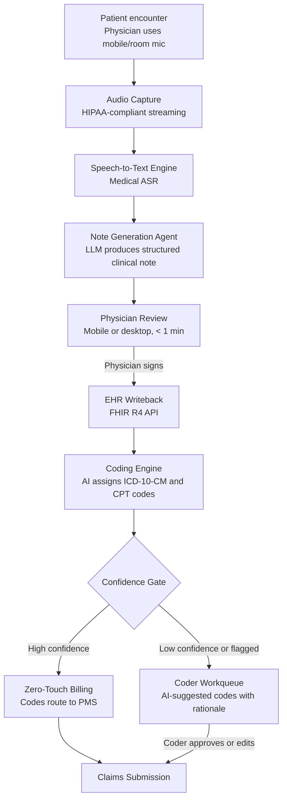

## What This Design Covers

This design covers an end-to-end system that listens to patient-physician encounters, generates structured clinical notes, assigns ICD-10-CM and CPT codes, and routes routine cases to billing with minimal human intervention. The operating model pairs ambient documentation — where physicians review and sign AI-drafted notes — with autonomous coding, where high-confidence code assignments bypass human coders entirely. The design boundary includes ambulatory (outpatient) encounters integrated with a major EHR platform such as Epic or Oracle Health. Inpatient coding, surgical procedures, and multi-day encounters are outside the first release.

## Recommended Operating Model

| Decision Area | Recommendation |
|---------------|----------------|
| **Autonomy Model** | Two-tier. Documentation is human-on-the-loop: AI drafts the note, physician reviews and signs (typically under 1 minute). Coding is autonomous for high-confidence encounters (target 90%+ zero-touch) with coder review for flagged cases. [S7][S8] |
| **System of Record** | The EHR (Epic or Oracle Health) remains authoritative for clinical notes, problem lists, and orders. The practice management system (PMS) or revenue cycle module remains authoritative for billing. |
| **Human Decision Points** | Physician signs every clinical note — this is a legal and clinical safety requirement. Coders review flagged encounters (low confidence, high complexity, new patient). Compliance audits a random sample of zero-touch coded encounters. [S14] |
| **Primary Value Driver** | Documentation time reduction (30 min/day per provider) drives physician retention and capacity. Autonomous coding reduces coder labor by 60–70% on eligible encounters and improves revenue capture through more complete diagnosis documentation. [S2][S8] |

## Architecture

### System Diagram

### Component Responsibilities

| Component | Role | Notes |
|-----------|------|-------|
| Audio Capture | Records the patient-physician conversation via smartphone app or room microphone, streams encrypted audio to the ASR engine. | Must enforce HIPAA encryption in transit. Patient consent captured before recording starts. [S12] |
| Speech-to-Text Engine | Converts audio to a diarized transcript (speaker-labeled). | Medical-grade ASR with domain vocabulary. Microsoft Dragon, Deepgram, or equivalent. [S12] |
| Note Generation Agent | Produces a structured clinical note (SOAP, HPI, ROS, assessment/plan) from the transcript using an LLM with specialty-specific templates. | Core AI component. Must generate structured output that maps to EHR documentation fields. Hallucination controls are critical here. [S6] |
| Coding Engine | Reads the finalized clinical note and assigns ICD-10-CM diagnosis codes and CPT evaluation-and-management codes. Validates against NCCI edits, medical necessity rules, and bundling logic. | Can be a dedicated coding AI (Fathom, CodaMetrix, Solventum 360 Encompass) or an LLM with coding-specific fine-tuning. Deterministic rules engine validates all AI-suggested codes. [S7][S8] |
| Confidence Gate | Routes encounters based on coding confidence score and complexity flags. | Configurable thresholds: code confidence, encounter complexity (new vs. established), E/M level, procedure presence. |
| EHR Integration Layer | Reads patient context (problem list, medications, prior visits) before the encounter and writes the signed note back after physician review. | FHIR R4 APIs. SMART on FHIR for authentication. [S11] |

## End-to-End Flow

| Step | What Happens | Owner |
|------|---------------|-------|
| 1 | Physician opens the ambient AI app and starts recording. Patient consent is captured (verbal or written per site policy). Audio streams to ASR engine. | Physician + Audio Capture |
| 2 | ASR produces a speaker-diarized transcript. Note Generation Agent creates a structured clinical note using the transcript, patient context from EHR (problem list, medications, allergies), and specialty templates. | Note Generation Agent |
| 3 | Physician reviews the draft note on mobile or desktop. Reviews typically take under 1 minute for routine encounters. Physician edits if needed and signs. [S2][S4] | Physician |
| 4 | Signed note writes to the EHR via FHIR API. Coding Engine reads the note and assigns ICD-10-CM and CPT codes. Rules engine validates codes against NCCI edits, LCD/NCD medical necessity, and bundling rules. | EHR Integration + Coding Engine |
| 5 | Confidence Gate evaluates code assignments. High-confidence encounters (target 90%+) route directly to billing. Low-confidence or flagged encounters route to coder workqueue with AI-suggested codes and supporting rationale. [S7][S8] | Confidence Gate |
| 6 | Coder reviews flagged encounters, accepts or edits codes. All encounters (zero-touch and coder-reviewed) proceed to claims submission. Compliance team audits a random sample. | Coder + Compliance |

## AI Responsibilities and Boundaries

| Workflow Area | AI Does | Deterministic System Does | Human Owns |
|---------------|---------|---------------------------|------------|
| Documentation | Generates structured clinical note from encounter audio. Summarizes relevant patient history. Populates specialty-specific templates. [S6][S12] | Validates note structure against required EHR fields. Enforces documentation completeness rules. | Physician reviews and signs every note. Edits clinical content. Bears legal responsibility for accuracy. |
| Coding | Suggests ICD-10-CM and CPT codes with confidence scores. Identifies diagnoses mentioned in the note that may be under-documented. [S7][S8] | Validates codes against NCCI edits, LCD/NCD rules, bundling logic, and modifier requirements. Rejects invalid code combinations. | Coder reviews flagged encounters. Compliance audits zero-touch encounters. Coder bears responsibility for coding accuracy on reviewed cases. |
| Revenue integrity | Flags potential under-coding where documented conditions lack corresponding codes. [S14] | Enforces payer-specific rules and fee schedules. Blocks codes that fail medical necessity checks. | Compliance investigates upcoding patterns. Finance monitors revenue shifts post-deployment. |

## Integration Seams

| System | Integration Method | Why It Matters |
|--------|--------------------|----------------|
| EHR (Epic or Oracle Health) | FHIR R4 APIs via SMART on FHIR; Epic Toolbox or Oracle Health marketplace for embedded launch | The EHR is the system of record for clinical documentation. Bi-directional: read patient context pre-encounter, write signed notes post-encounter. FHIR R4 provides 450+ standardized endpoints. [S11] |
| Practice Management / Billing System | HL7v2 or FHIR charge posting; direct PMS API for larger systems | Coded encounters must flow to billing without manual re-entry. Zero-touch path requires automated charge capture. |
| Audio Capture Platform | HIPAA-compliant audio streaming API (WebSocket or gRPC) | Audio is PHI. Encryption in transit (TLS 1.2+) and at rest required. BAA with audio processing vendor mandatory. Configurable retention policy (many sites delete audio after note signing). [S12] |
| Coding Reference Databases | CMS ICD-10-CM/PCS files, AMA CPT, CMS NCCI edits, LCD/NCD database | Codes update annually (October for ICD-10, January for CPT). Rules engine must refresh on the CMS release cycle. Stale code tables cause claim denials. |
| Identity Provider | OAuth 2.0 / SAML via institutional IdP | Physicians and coders authenticate through existing hospital SSO. SMART on FHIR scopes control what the AI platform can read and write. |

## Control Model

| Risk | Control |
|------|---------|
| Note hallucination — AI fabricates clinical findings not discussed in the encounter [S6] | Structured output templates constrain note sections to transcript-grounded content. Confidence scoring per section. Random audio-vs-note audits (recommended 5% sample). Published hallucination rates range from 0.2% to 1.5% with optimized prompts; physician review is the final safety net. [S6][S14] |
| Upcoding — AI systematically assigns higher-complexity codes than warranted [S14] | Deterministic rules engine validates E/M level against documented elements. Pre/post deployment E/M level distribution monitoring. Compliance dashboard tracks code-level shifts by specialty. Payer audits remain the external check. [S14] |
| PHI exposure — audio and transcripts contain sensitive patient data | BAA with every vendor in the processing chain. Audio encrypted in transit and at rest. Configurable audio deletion after note signing. HIPAA minimum necessary principle enforced in FHIR scopes. [S9] |
| Coding errors causing claim denials | NCCI edit validation before submission. Denial rate monitoring by code and specialty. Feedback loop from denied claims to coding model retraining. Target: 60% reduction in coding-related denials. [S8] |
| Regulatory non-compliance (HTI-1, HIPAA) | ONC HTI-1 compliance: algorithm transparency documentation, fairness assessments, source attribute tracking. Joint Commission/CHAI governance framework. Full audit trail from audio to billed claim. [S9][S10] |

## Reference Technology Stack

| Layer | Default Choice | Reason | Viable Alternative |
|-------|----------------|--------|--------------------|
| **Model layer** | Claude for note generation from transcripts; Fathom or CodaMetrix for autonomous coding | LLM handles the variety of clinical language across specialties. Purpose-built coding engines have validated accuracy (98%+) and are KLAS-rated. [S7][S8] | GPT-4o for note generation; Solventum 360 Encompass or Nym Health for coding. |
| **Orchestration** | Event-driven pipeline (note signed → trigger coding → route by confidence) | The two pipelines (documentation and coding) are sequential but loosely coupled. Event-driven design allows each to scale and fail independently. | LangGraph if tighter agent coordination is needed; Temporal for durable execution with retry. |
| **Retrieval / memory** | EHR-sourced patient context via FHIR read (problem list, medications, prior notes) | Pre-encounter context improves note accuracy and code completeness. No separate vector store needed — the EHR is the retrieval source. [S11] | RAG over local note archive if EHR FHIR access is latency-constrained. |
| **Observability** | OpenTelemetry traces per encounter; structured quality logs; compliance dashboards | Every encounter needs a traceable path from audio capture through billed claim. HTI-1 requires algorithm transparency documentation. [S9] | Datadog or Splunk for health systems with existing observability stacks. |

## Key Design Decisions

| Decision | Choice | Why It Fits This Use Case |
|----------|--------|---------------------------|
| Separate documentation and coding into two pipelines | Documentation pipeline ends at physician sign-off; coding pipeline starts from the signed note | Physician must sign the note before codes are assigned — this is a legal and compliance boundary. Separating the pipelines allows different AI vendors for each (e.g., Abridge for documentation, Fathom for coding). Also allows phased rollout. |
| Physician signs every note, no exceptions | AI drafts but never finalizes clinical documentation | Legal requirement in all US jurisdictions. Physician is the author of record. This is not a pilot constraint — it is permanent. The AI's role is to reduce review time to under 1 minute, not to eliminate review. [S2][S3] |
| Zero-touch coding for high-confidence encounters | Encounters above confidence threshold bypass human coders entirely | Fathom reports 95.5% encounter-level automation at 98.3% accuracy. CodaMetrix reports 98% accuracy across 500+ hospitals. The economics require zero-touch to reduce coder labor costs. Coder review of every encounter would negate the ROI. [S7][S8] |
| Start with ambulatory encounters only | Exclude inpatient, surgical, and multi-day encounters from the first release | Ambulatory encounters are higher volume, more standardized, and have simpler coding (primarily E/M). Ambient audio capture is straightforward in an exam room. Inpatient encounters involve multiple providers, longer stays, and DRG-based coding — a different problem. |
| Use purpose-built coding engines, not general LLMs, for code assignment | Fathom, CodaMetrix, or Solventum rather than prompting an LLM to suggest codes | Purpose-built engines have validated accuracy at scale, are KLAS-rated, integrate with Epic Toolbox, and maintain code table currency. General LLMs lack deterministic code validation and have not been independently validated for coding accuracy. [S7][S8] |
