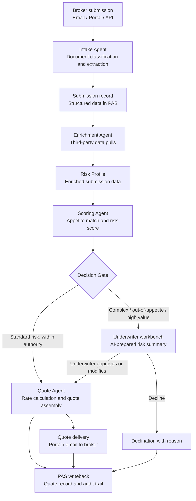

## What This Design Covers

This design covers the submission-to-quote path for personal and small-to-mid commercial P&C lines at a carrier that already operates a policy administration system (Guidewire, Duck Creek, or equivalent) and a separate rating engine. The reference pattern uses a multi-agent architecture where specialized AI agents handle document intake, risk enrichment, appetite matching, and quote generation. Standard in-appetite risks are auto-quoted; complex or out-of-appetite submissions route to human underwriters with a pre-assembled risk summary. [S1][S2][S5]

## Recommended Operating Model

| Decision Area | Recommendation |
|---------------|----------------|
| **Autonomy Model** | Semi-autonomous. Standard-appetite submissions below authority thresholds are auto-quoted without human review. Complex risks, high-value accounts, and out-of-appetite submissions route to underwriters with AI-prepared summaries. [S1][S4] |
| **System of Record** | The policy administration system (Guidewire PolicyCenter or equivalent) remains authoritative for policy data, submission status, and binding authority. [S5] |
| **Human Decision Points** | Underwriters review AI-escalated submissions, approve quotes above authority limits, handle broker negotiations, and oversee portfolio concentration. Actuaries own model governance and bias audits. [S3][S8] |
| **Primary Value Driver** | Cycle time compression from days to minutes on standard risks, increasing hit ratios with brokers. Secondary: reduced underwriting leakage through consistent appetite enforcement. [S2][S4] |

## Architecture

### System Diagram

### Component Responsibilities

| Component | Role | Notes |
|-----------|------|-------|
| Intake Agent | Classifies incoming documents (applications, loss runs, SOVs, supplementals), extracts structured fields, and maps them to the submission schema. | LLM-powered extraction handles unstructured email attachments; ACORD-formatted submissions use schema parsing. [S5][S7] |
| Enrichment Agent | Pulls third-party data (MVR, credit, property characteristics, CAT model scores, aerial imagery) and merges it into the risk profile. | Coalition's model scans external attack surfaces pre-quote; Zurich uses Nearmap aerial imagery for roof condition scoring. [S2][S6] |
| Scoring Agent | Evaluates the enriched submission against underwriting guidelines, scores risk appetite fit, and assigns a confidence level to the auto-quote recommendation. | Deterministic rules engine handles appetite boundaries; ML model scores risk quality within appetite. [S3] |
| Quote Agent | Feeds scored risk data into the carrier's rating engine, assembles the quote document with terms and conditions, and delivers it to the broker. | Rating engine remains the deterministic pricing authority; AI does not override filed rates. |
| Decision Gate | Routes submissions based on confidence score, authority thresholds, and risk complexity flags. | Configurable rules: premium size, line of business, prior-loss severity, model confidence threshold. |
| Underwriter Workbench | Presents AI-escalated submissions with a pre-assembled summary: extracted data, enrichment findings, scoring rationale, and recommended pricing range. | Cuts per-submission review time roughly in half by eliminating manual data assembly. [S4] |

## End-to-End Flow

| Step | What Happens | Owner |
|------|---------------|-------|
| 1 | Broker submits application and supporting documents via email, portal, or API. Intake Agent classifies documents and extracts structured data. | Intake Agent [S5][S7] |
| 2 | Submission record is created in the PAS. Enrichment Agent pulls third-party data sources and merges results into the risk profile. | Enrichment Agent [S2][S6] |
| 3 | Scoring Agent evaluates the enriched profile against underwriting guidelines and appetite rules. Returns a risk score, appetite match result, and confidence level. | Scoring Agent [S3] |
| 4 | Decision Gate routes the submission: auto-quote path for standard risks, or underwriter workbench for complex/escalated risks. | Decision Gate (deterministic rules) |
| 5 | Quote Agent feeds data to the rating engine, assembles the quote, and delivers it to the broker. For escalated risks, underwriter reviews and approves or declines. | Quote Agent or Underwriter |
| 6 | All decisions, data lineage, and model outputs are logged to the PAS and audit system. | PAS and audit trail |

## AI Responsibilities and Boundaries

| Workflow Area | AI Does | Deterministic System Does | Human Owns |
|---------------|---------|---------------------------|------------|
| Document intake | Classifies document types, extracts fields from unstructured attachments, flags missing information. [S5][S7] | Validates extracted data against ACORD schemas and required-field rules. | Reviews extraction failures and ambiguous documents. |
| Data enrichment | Orchestrates third-party API calls and merges external data into the risk profile. [S2][S6] | Enforces data-source access policies, caches responses, and logs all external queries. | Decides whether to override or supplement third-party data. |
| Risk scoring | Predicts risk quality score and recommends pricing adjustments within filed rate ranges. [S3] | Applies appetite rules, authority limits, and compliance constraints as hard gates. | Approves all quotes above authority threshold; overrides any AI recommendation. |
| Quote generation | Assembles quote document and broker communication. | Rating engine calculates premium from filed rate tables and approved factors. | Signs off on non-standard terms, manuscript endorsements, and large accounts. |

## Integration Seams

| System | Integration Method | Why It Matters |
|--------|--------------------|----------------|
| Policy administration system (Guidewire, Duck Creek) | REST API (Guidewire Cloud API or equivalent) | System of record for submissions, policies, and quotes. All AI outputs must write back here. [S5] |
| Rating engine | API or embedded library call | Deterministic pricing authority; AI feeds enriched data in but does not modify rate logic. |
| Third-party data providers (LexisNexis, Verisk, Nearmap, credit bureaus) | REST APIs with vendor-specific authentication | Enrichment quality directly affects risk scoring accuracy. Each provider has its own rate limits and data contracts. [S2][S6] |
| Broker portal / email gateway | REST API for portal; IMAP/SMTP parsing for email submissions | 60–70% of submissions arrive via email; the intake agent must handle both channels. [S7] |
| ACORD data exchange | XML/JSON schema parsing per ACORD standards | Structured ACORD submissions bypass LLM extraction and go directly to schema validation. [S7] |

## Control Model

| Risk | Control |
|------|---------|
| Extraction error from unstructured documents | Schema validation against required fields; confidence scores on each extracted value; low-confidence fields flag for human review before scoring proceeds. [S5] |
| Inconsistent risk scoring or appetite drift | Deterministic appetite rules as hard constraints; ML risk score as a soft recommendation within those constraints; quarterly model performance review against actual loss experience. [S3] |
| Proxy-variable bias in pricing | Pre-deployment disparate impact testing across protected classes; ongoing monitoring of quote-rate distributions by geography and demographic proxy; audit trail for every scoring factor. [S8] |
| Unauthorized binding above authority limits | Authority thresholds enforced in the Decision Gate as deterministic rules; no AI component can override binding authority. |
| Third-party data outage | Fallback to manual enrichment queue; submission is routed to underwriter if required data sources are unavailable. |

## Reference Technology Stack

| Layer | Default Choice | Reason | Viable Alternative |
|-------|----------------|--------|--------------------|
| **Model layer** | Claude or GPT-4 for document extraction and summarization; gradient-boosted model (XGBoost) for risk scoring | LLMs handle unstructured document variety; supervised ML models are more interpretable and auditable for regulated risk scoring. [S3][S5] | Gemini for extraction; proprietary actuarial models for scoring. |
| **Orchestration** | LangGraph or custom Python orchestrator with state machine | Multi-agent workflows need explicit state transitions and retry logic; LangGraph supports conditional routing and human-in-the-loop. | Temporal for durable execution; Guidewire Autopilot for carriers already on the platform. [S5] |
| **Retrieval / memory** | Vector store for underwriting guidelines and historical submission lookup | Scoring Agent needs to reference current appetite guidelines and comparable past quotes. | Full-text search index if guideline corpus is small. |
| **Observability** | OpenTelemetry traces per submission; structured decision logs | Every auto-quoted submission must have a traceable audit path for regulatory examination. [S8] | Datadog or Splunk for carriers with existing observability stacks. |

## Key Design Decisions

| Decision | Choice | Why It Fits This Use Case |
|----------|--------|---------------------------|
| Separate extraction from scoring | LLM handles document extraction; supervised ML handles risk scoring | Extraction benefits from LLM flexibility across document formats. Risk scoring needs interpretability and auditability for regulators; gradient-boosted models provide feature-importance explanations that LLMs cannot. [S3][S8] |
| Rating engine stays deterministic | AI feeds data into the rating engine but never modifies rate tables or filed factors | Rate filings are regulatory artifacts. Letting AI adjust rates would create compliance exposure and invalidate filed rate justifications. |
| Appetite rules as hard constraints, not suggestions | Deterministic rules engine enforces appetite boundaries; AI operates within those boundaries | Prevents the scoring model from drifting outside the carrier's defined risk appetite even if the model identifies an opportunity. |
| Build around the PAS, not around the AI | All submission state lives in the PAS; AI agents read from and write to PAS via API | Avoids creating a shadow system of record; keeps underwriter workflows in their existing tools; simplifies audit. [S5] |
