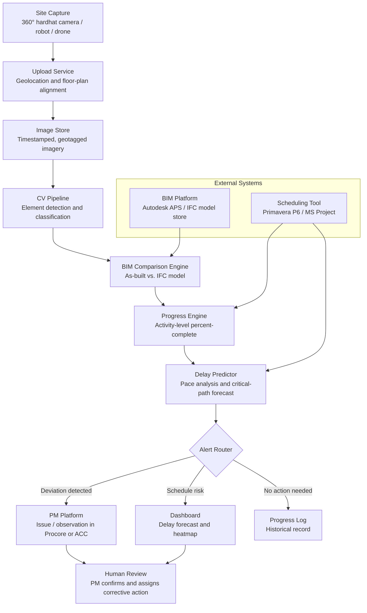

## What This Design Covers

This design covers the daily capture-to-alert path for general contractors and construction managers running commercial, institutional, or industrial projects that use BIM and CPM scheduling. The reference pattern uses a computer vision pipeline that compares 360-degree site imagery against the IFC model and project schedule to measure work-in-place, detect deviations, and predict delays. Alerts route to project managers through existing PM platforms. Human teams own all intervention decisions. [S1][S2][S6]

## Recommended Operating Model

| Decision Area | Recommendation |
|---------------|----------------|
| **Autonomy Model** | Autonomous for capture processing, progress measurement, and delay forecasting. Human-in-the-loop for all intervention decisions: crew reassignment, schedule acceleration, and subcontractor negotiation. [S1][S2] |
| **System of Record** | The scheduling tool (Primavera P6 or Microsoft Project) remains authoritative for the CPM baseline and contractual milestones. The PM platform (Procore or Autodesk Build) remains authoritative for project records, issues, and RFIs. [S8][S9] |
| **Human Decision Points** | Project managers decide how to respond to deviation alerts. Superintendents confirm or override AI-flagged issues before they propagate to subcontractors. Owners approve draw requests based on AI-measured progress with PM sign-off. |
| **Primary Value Driver** | Early deviation detection converts reactive schedule recovery into proactive intervention, reducing delay cascades and rework. Intel avoided 4 weeks of delay per fab; Doxel/Kaiser achieved 38% productivity gain. [S1][S2] |

## Architecture

### System Diagram

### Component Responsibilities

| Component | Role | Notes |
|-----------|------|-------|
| Capture Device | Collects 360-degree imagery during routine site walks. | Hardhat-mounted cameras (Buildots, OpenSpace) are the lowest-friction option; robots and drones cover large or hard-to-reach areas. [S1][S5] |
| Upload Service | Geolocates each image against floor plans and timestamps the capture. | OpenSpace and Buildots use visual SLAM to auto-locate captures without manual floor-plan tagging. [S4][S5] |
| CV Pipeline | Detects and classifies construction elements (MEP, framing, finishes) in each image frame. | Deep learning models trained on thousands of construction element types. Buildots reports recognizing elements down to individual outlets and fixtures. [S1][S3] |
| BIM Comparison Engine | Aligns detected elements against the IFC model to identify installed, missing, or out-of-spec work. | Compares as-built imagery against as-planned BIM geometry using voxel occupancy or element-level matching. [S10] |
| Progress Engine | Calculates activity-level percent-complete by mapping detected elements to CPM schedule activities. | Reads schedule baseline from P6 or MSP; updates actual progress per activity. [S1][S2] |
| Delay Predictor | Analyzes pace-of-progress trends to forecast delay risk on critical-path and near-critical activities. | Buildots reports 50% delay reduction using this approach; Doxel achieved 96% cost-at-completion accuracy with 6x more lead time. [S1][S2] |
| Alert Router | Routes deviations and forecasts to the appropriate channel based on severity and type. | Creates BCF issues for BIM-related deviations; creates observations in Procore for field issues. [S7][S9] |

## End-to-End Flow

| Step | What Happens | Owner |
|------|---------------|-------|
| 1 | Superintendent walks the site wearing a 360-degree camera. Imagery uploads automatically when the device connects to the site network. | Capture device and upload service |
| 2 | CV pipeline processes imagery: detects construction elements, classifies completion state, and geolocates each observation against the floor plan. | CV pipeline (automated) [S1][S3] |
| 3 | BIM comparison engine aligns detected elements against the IFC model. Deviations (missing work, out-of-sequence installs, quality issues) are flagged with confidence scores. | BIM comparison engine (automated) [S10] |
| 4 | Progress engine calculates percent-complete per schedule activity. Delay predictor compares current pace against the baseline and forecasts critical-path risk. | Progress engine and delay predictor (automated) [S1][S2] |
| 5 | Alert router creates issues in the PM platform for confirmed deviations. Dashboard updates with delay forecasts and progress heatmaps. | Alert router (automated) [S7][S9] |
| 6 | Project manager reviews alerts, confirms or overrides flagged issues, and assigns corrective actions to subcontractor leads. | Project manager (human) |

## AI Responsibilities and Boundaries

| Workflow Area | AI Does | Deterministic System Does | Human Owns |
|---------------|---------|---------------------------|------------|
| Site capture processing | Detects construction elements, classifies installation state, geolocates observations against floor plans. [S1][S3] | Validates image quality (resolution, lighting, coverage completeness) before processing. | Decides capture frequency and route; handles areas the camera cannot reach. |
| Progress measurement | Compares detected elements against BIM model; calculates activity-level percent-complete. [S10] | CPM engine computes schedule float, critical path, and earned value from AI-provided actuals. [S8] | Approves progress claims for payment applications; resolves disputes with subcontractors. |
| Delay prediction | Forecasts delay risk based on pace-of-progress trends and historical patterns. [S1][S2] | Threshold rules determine which forecasts trigger alerts vs. log-only entries. | Decides intervention strategy: crew reassignment, sequencing changes, acceleration. |
| Issue creation | Generates deviation reports with location, element ID, BIM reference, and confidence score. [S7] | PM platform enforces issue workflow (assignment, status tracking, resolution). [S9] | Confirms issues, assigns responsibility, approves closures. |

## Integration Seams

| System | Integration Method | Why It Matters |
|--------|--------------------|----------------|
| BIM platform (Autodesk APS / ACC) | Model Derivative API for IFC model access; Data Exchange Cloud Connector for IFC subsets [S8] | The IFC model is the ground truth for what should be built. The pipeline must read element geometry, properties, and GUIDs to compare against as-built captures. |
| Scheduling tool (Primavera P6 / MS Project) | XER or XML schedule import; API for P6 Cloud or Project Online | Activity definitions, baseline dates, and logic ties are required to map progress measurements to schedule activities and compute delay forecasts. |
| PM platform (Procore / Autodesk Build) | REST API for creating observations, issues, and daily log entries [S9] | Deviations must appear in the system project teams already use. Creating issues in a separate tool kills adoption. |
| Capture hardware (360° cameras) | Vendor SDK or file-based upload (MP4/JPEG with embedded metadata) | Auto-location and timestamp metadata must flow from the camera to the processing pipeline without manual tagging. [S4][S5] |
| BIM Collaboration Format (BCF) | BCF-API (REST) or .bcfzip file exchange for model-referenced issues [S7] | BCF is the open standard for linking issues to specific BIM elements. Avoids vendor lock-in and works across BIM authoring tools. |

## Control Model

| Risk | Control |
|------|---------|
| CV misclassification (false progress or false deviation) | Confidence scores on every detected element; deviations below confidence threshold require superintendent confirmation before routing to subcontractors. Periodic ground-truth calibration against manual spot checks. [S1] |
| Coverage gaps (areas not captured) | Capture completeness scoring per floor and zone. Dashboard highlights uncaptured areas. Minimum coverage threshold (e.g., 85% of floor area) before progress report is published. |
| BIM model drift (model does not reflect approved changes) | Model version tracking. Alert when the IFC model has not been updated within a configurable window. Integration with change order workflow to flag pending design changes. [S7] |
| Privacy (worker imagery) | Automated face blurring in all stored imagery. Access controls limiting raw image access to authorized roles. Retention policy aligned with project closeout requirements. |
| Delay prediction overconfidence | Predictions labeled with confidence intervals, not point estimates. Historical accuracy displayed alongside each forecast. Human override required before predictions flow into contractual schedule updates. |

## Reference Technology Stack

| Layer | Default Choice | Reason | Viable Alternative |
|-------|----------------|--------|--------------------|
| **Model layer** | Custom CNN/YOLO models for element detection; XGBoost for delay prediction | Element detection needs high-throughput visual inference; delay prediction benefits from interpretable feature importance. [S1][S10] | Detectron2 for instance segmentation; LightGBM for delay prediction. |
| **Orchestration** | Python pipeline with Celery task queue and Redis broker | Daily batch processing with per-floor parallelism; Celery handles retry logic for failed image processing jobs. | Temporal for durable execution; Apache Airflow for teams with existing data pipeline infrastructure. |
| **Retrieval / memory** | IFC model store (file-based or IfcOpenShell); time-series database (TimescaleDB) for progress history | BIM elements referenced by GUID; progress trends need time-series queries for pace analysis and forecasting. [S7] | PostgreSQL with spatial extensions; InfluxDB for progress metrics. |
| **Observability** | MLflow for model versioning and accuracy tracking; Grafana for pipeline metrics and alert dashboards | CV model accuracy must be tracked per element type over time; pipeline latency and failure rates need monitoring. | Weights & Biases for model tracking; Datadog for infrastructure monitoring. |

## Key Design Decisions

| Decision | Choice | Why It Fits This Use Case |
|----------|--------|---------------------------|
| CV models over LLMs for element detection | Specialized object detection models (YOLO, Detectron2) process site imagery | Element detection is a high-throughput, low-latency visual task. LLMs add cost and latency without accuracy benefit for structured detection. LLMs are useful only for the natural-language query layer. |
| BIM model as ground truth, not just photos | Compare as-built captures against the IFC design model, not against previous captures | Photo-to-photo comparison detects change but not correctness. BIM comparison catches out-of-spec work, not just missing work. This is what distinguishes progress monitoring from time-lapse photography. [S10] |
| Daily capture cadence as default | One full-site capture per working day | Balances detection speed (same-day deviation alerts) against operational overhead. Higher frequency (continuous robot patrols) is viable for high-value projects like semiconductor fabs. [S1] |
| BCF for issue handoff to BIM tools | Use the open BCF standard for model-referenced issue creation | Avoids vendor lock-in. BCF issues carry element GUIDs, viewpoints, and coordinates that work across Revit, Navisworks, Solibri, and other IFC-compatible tools. [S7] |
| Scheduling tool stays authoritative for CPM | AI writes progress actuals but does not modify schedule logic, float calculations, or baseline dates | Schedule logic is contractual. Automated modification would create liability and undermine trust with owners and subcontractors. |
