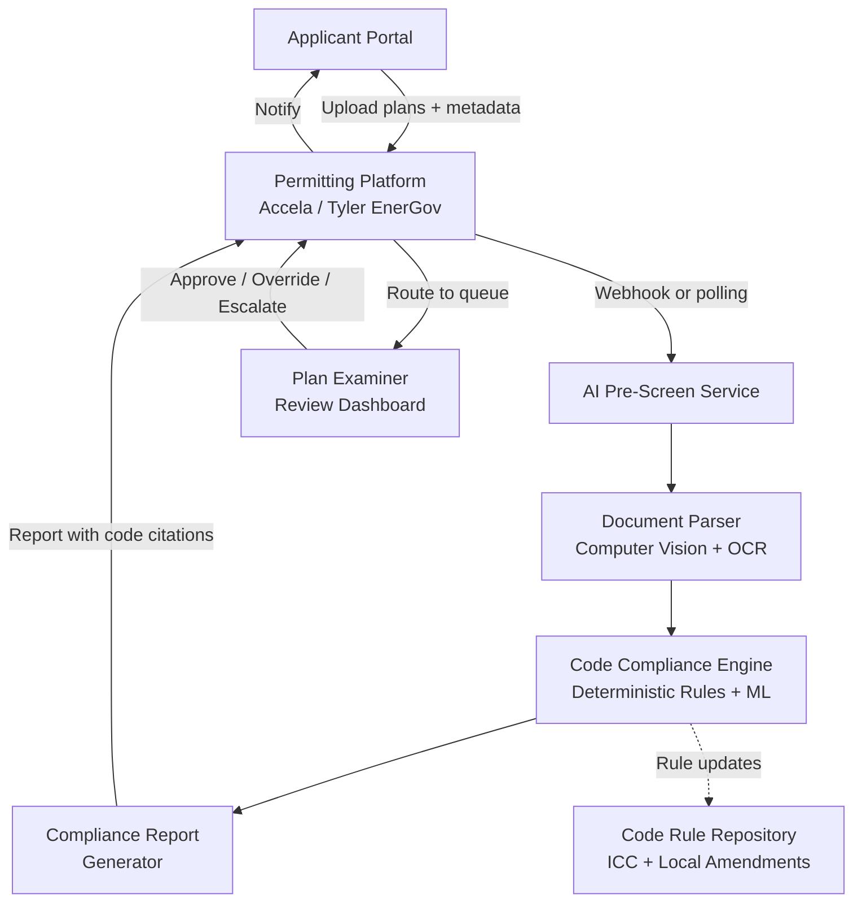

## What This Design Covers

Municipal building departments spend the bulk of plan review time on repetitive code-compliance checks that are rule-based and deterministic. This design describes an AI pre-screening layer that reviews submitted architectural plans against digitized zoning, building, fire, and accessibility codes before a human examiner sees them. The system is advisory — a licensed plan examiner retains sign-off authority. The design boundary covers intake through compliance report delivery; field inspection and permit issuance remain with existing systems.

## Recommended Operating Model

| Decision Area | Recommendation |
|---------------|----------------|
| **Autonomy Model** | AI-assisted pre-screening with mandatory human sign-off. AI generates compliance reports; examiners approve, override, or escalate. No autonomous permit issuance. |
| **System of Record** | The existing permitting platform (Accela, Tyler EnerGov, or equivalent) remains the system of record for applications, status, and issued permits. |
| **Human Decision Points** | Final approval on every application. Variance and overlay district interpretation. Complex structural or novel system reviews. Override of any AI-flagged item. |
| **Primary Value Driver** | Shift examiner effort from first-pass rule checking (estimated 70–90% of review time) to judgment-intensive cases. Reduce correction cycles by catching deficiencies before formal review. |

## Architecture

### System Diagram

### Component Responsibilities

| Component | Role | Notes |
|-----------|------|-------|
| **Permitting Platform** | System of record for applications, status tracking, fee collection, and permit issuance | Existing investment; AI layer integrates via API, not replacement |
| **Document Parser** | Extracts spatial data, dimensions, annotations, and sheet structure from uploaded PDFs using computer vision and OCR | Must handle varied drawing quality, hand-drawn markups, and scanned documents |
| **Code Compliance Engine** | Matches extracted building data against digitized code rules; combines deterministic rule evaluation with ML classification for ambiguous elements | Deterministic rules prevent hallucination on measurable checks (setbacks, heights, room dimensions); ML handles pattern recognition (smoke detector placement, landscaping adequacy) |
| **Compliance Report Generator** | Produces structured reports with pass/fail per code section, marked-up plan sheets, and plain-language correction guidance | Report must cite specific code sections so applicants and examiners can verify findings |
| **Code Rule Repository** | Stores digitized versions of IBC/IRC, local zoning ordinances, fire codes, and accessibility standards with versioning | Must track code cycle updates (typically every 3 years for ICC codes, more frequent for local amendments) |

## End-to-End Flow

| Step | What Happens | Owner |
|------|---------------|-------|
| 1 | Applicant uploads plans and project metadata through the permitting portal | Applicant |
| 2 | Permitting platform triggers AI pre-screen via webhook; document parser extracts spatial data, dimensions, and annotations from plan sheets | AI Pre-Screen Service |
| 3 | Code compliance engine evaluates extracted data against applicable zoning, building, fire, plumbing, structural, and accessibility rules | AI Pre-Screen Service |
| 4 | Compliance report with pass/fail by discipline, marked-up sheets, and code citations is written back to the permitting platform and sent to the applicant | AI Pre-Screen Service |
| 5 | Applicant corrects flagged issues and resubmits (if needed) before entering the human review queue; pre-screened applications are routed to examiners with the AI report attached | Applicant → Permitting Platform |
| 6 | Plan examiner reviews AI findings, applies professional judgment on flagged and unflagged items, approves or requests further corrections | Plan Examiner |

## AI Responsibilities and Boundaries

| Workflow Area | AI Does | Deterministic System Does | Human Owns |
|---------------|---------|---------------------------|------------|
| **Completeness check** | Detect missing sheets, incomplete title blocks, absent calculations | Validate file formats, page counts against declared scope | Waive requirements for phased submissions |
| **Zoning compliance** | Check setbacks, lot coverage, height limits, FAR against parcel data | Look up parcel zoning designation from GIS | Interpret variances, conditional use permits, overlay district exceptions |
| **Building code checks** | Verify room dimensions, egress widths, stair geometry, structural member sizing against IRC/IBC tables | Apply unit conversions, table lookups | Evaluate novel structural systems, engineering judgment calls |
| **Fire and accessibility** | Flag smoke detector placement, sprinkler coverage gaps, ADA clearance violations | Compute travel distances, occupancy loads | Approve alternative means of compliance, fire department referrals |

## Integration Seams

| System | Integration Method | Why It Matters |
|--------|--------------------|----------------|
| **Permitting platform (Accela / Tyler EnerGov)** | REST API or webhook for application events; file upload/download for plans and reports | The permitting platform is the single source of truth; the AI layer must not create a parallel status or data store |
| **GIS / parcel database** | REST API to municipal GIS for parcel boundaries, zoning designations, overlay districts, flood zones | Zoning checks require parcel-specific context that changes with annexations and rezoning |
| **Electronic plan review tool (Avolve ProjectDox / e-PlanSoft)** | API for plan markup exchange; shared viewer for examiner annotations alongside AI annotations | Many departments already use electronic plan review; AI must layer in, not replace the existing markup workflow |
| **ICC Digital Codes / local code repository** | Periodic bulk import of code text with version tracking; local amendments maintained as override rules | Code rules change on 3-year ICC cycles and ad-hoc local amendments; stale rules produce wrong compliance findings |

## Control Model

| Risk | Control |
|------|---------|
| **AI misclassifies a drawing element** (e.g., misreads a dimension, misidentifies a room type) | Compliance report includes confidence scores; items below threshold are flagged as "needs examiner review" rather than pass/fail. Examiner reviews all AI findings before approval. |
| **Code rule is outdated or incorrectly digitized** | Rule repository is versioned with effective dates. Each rule maps to a specific ICC section or local ordinance number. Quarterly audit compares digitized rules against published code text. |
| **AI approves a non-compliant plan** (false negative) | AI pre-screening is advisory only. Human examiner reviews every application independently. AI miss rate is tracked and reported monthly. |
| **Applicant data confidentiality** | Plans are processed in a tenant-isolated environment. No plan data is used for model training without explicit municipal consent. Data retention follows the jurisdiction's public records policy. |

## Reference Technology Stack

| Layer | Default Choice | Reason | Viable Alternative |
|-------|----------------|--------|--------------------|
| **Model layer** | Computer vision model (custom CNN or vision transformer) + deterministic rule engine | Building plan analysis requires spatial understanding that general-purpose LLMs lack; deterministic rules ensure consistency on measurable code checks | Archistar AI PreCheck or CivCheck as managed service (buy vs. build) |
| **Orchestration** | Event-driven pipeline triggered by permitting platform webhooks | Municipal applications arrive asynchronously; event-driven avoids polling and scales with volume spikes | Message queue (RabbitMQ / Azure Service Bus) for departments with batch processing patterns |
| **Retrieval / memory** | Code rule repository stored in a structured database with version history; parcel data retrieved from GIS at runtime | Rules must be auditable and versioned; parcel data changes frequently | Vector store for fuzzy code search to support examiner Q&A (secondary feature) |
| **Observability** | Structured logging with per-application trace IDs; dashboard showing pre-screen volume, pass rates, examiner override rates | Municipal IT needs audit trails for public records requests; override rate is the primary quality signal | Open-source stack (Grafana + Loki) for departments with limited SaaS budget |

## Key Design Decisions

| Decision | Choice | Why It Fits This Use Case |
|----------|--------|---------------------------|
| **Advisory-only AI, no autonomous approval** | AI generates reports; humans sign off | State licensing laws require a credentialed examiner to approve plans. Removing the human would require legislative change and creates unacceptable liability. |
| **Deterministic rules over LLM for measurable checks** | Rule engine for setbacks, dimensions, occupancy loads; ML only for pattern recognition tasks | Deterministic rules produce identical results every time, which is critical for code enforcement consistency. LLM-generated compliance findings would be non-reproducible and legally indefensible. |
| **Pre-screening before formal review, not inline copilot** | AI runs before examiner sees the application | The largest time savings come from catching deficiencies before they enter the human queue. Denver's baseline of 37% first-pass acceptance shows most applications need corrections that AI can flag upfront. |
| **Integrate with existing permitting platform, don't replace it** | API integration with Accela / Tyler EnerGov | Municipalities have multi-year investments in their permitting platforms. Rip-and-replace is not feasible given procurement cycles and training costs. Austin's $3.5M Archistar contract is an add-on, not a platform swap. |
