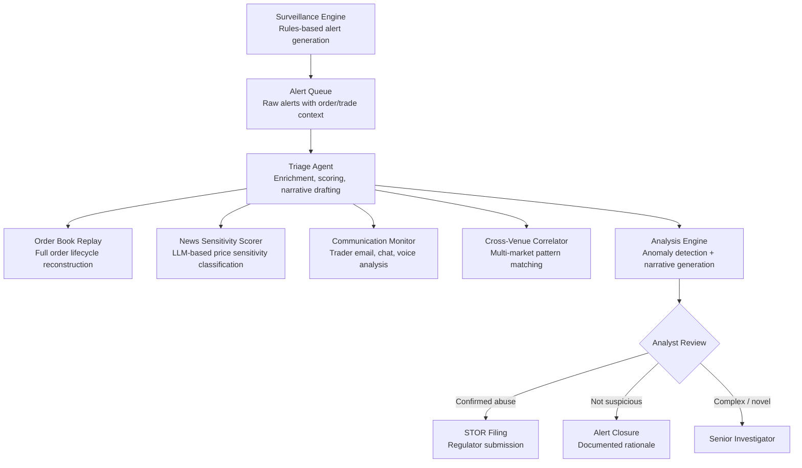

## What This Design Covers

This design covers the alert-to-investigation path for post-trade and post-order market abuse surveillance at exchanges, broker-dealers, and asset managers. The recommended operating model uses agentic AI to triage alerts, enrich them with order-book replay, news sensitivity analysis, and communication monitoring, then produce scored investigation packages with draft narratives for human review. The design boundary starts when the surveillance engine generates an alert and ends when a surveillance analyst either closes the alert with documented rationale or escalates a confirmed case for STOR filing to the regulator.

## Recommended Operating Model

| Decision Area | Recommendation |
|---------------|----------------|
| **Autonomy Model** | Human-on-the-loop. The AI agent triages, enriches, scores, and drafts investigation narratives autonomously. Surveillance analysts review every disposition recommendation. No STOR is filed or alert closed without human sign-off. [S1][S4] |
| **System of Record** | The existing surveillance platform (Nasdaq SMARTS, NICE Actimize SURVEIL-X, or equivalent) remains authoritative for alert status, investigation history, and regulatory filing records. [S1][S3] |
| **Human Decision Points** | Surveillance analysts review AI-prepared investigation packages. Senior investigators handle cases the agent flags as low-confidence or novel-pattern. Compliance officers approve every STOR submission. [S4][S7] |
| **Primary Value Driver** | False positive reduction (up to 85%) and investigation time compression (33% reduction demonstrated in pilot), enabling the same analyst team to focus on genuine market abuse instead of closing noise. Secondary: detection of novel manipulation patterns that static rules miss entirely. [S1][S3] |

## Architecture

### System Diagram

### Component Responsibilities

| Component | Role | Notes |
|-----------|------|-------|
| Surveillance Engine | Generates alerts from rules-based pattern templates (spoofing, layering, wash trading, insider dealing thresholds). Provides alert context: triggering orders/trades, instrument, venue, timestamps. | Existing system; not replaced. AI augments downstream investigation. Nasdaq SMARTS processes 1B+ transactions/day across 200+ venues. [S1][S5] |
| Triage Agent | Orchestrates data retrieval from order-book replay, news feeds, communication archives, and cross-venue data. Assembles a unified investigation package, scores alert severity, and drafts a structured narrative. | Core agentic component. Each investigation is a stateful workflow with parallel tool calls. Handles data unavailability gracefully. |
| News Sensitivity Scorer | Classifies regulatory news service articles by price sensitivity to contextualize insider dealing alerts. | LLM-based. LSEG achieved 100% precision on non-sensitive news and 100% recall on price-sensitive content using Claude on Amazon Bedrock. [S2] |
| Communication Monitor | Analyzes trader emails, chats, and voice transcripts for indicators of collusion, insider dealing, or coordination. | NICE Actimize's implementation covers 150+ languages and explains what it found with precise citations. [S3] |
| Cross-Venue Correlator | Matches order patterns across multiple trading venues to detect cross-market manipulation (venue-hopping spoofing, coordinated layering). | Critical for detecting abuse that single-venue surveillance misses. Requires bilateral data sharing agreements or consolidated feed. |

## End-to-End Flow

| Step | What Happens | Owner |
|------|---------------|-------|
| 1 | Surveillance engine flags orders/trades against pattern templates. Alert enters the queue with triggering data, instrument, venue, and timestamps. | Surveillance Engine |
| 2 | Triage agent receives the alert and executes parallel tool calls: order-book replay for the instrument window, news feed scan for the issuer, communication archive search for the flagged trader, and cross-venue order pattern query. | Triage Agent |
| 3 | Anomaly detection models (isolation forest, autoencoder) score the order/trade pattern against baseline behavior for the instrument and trader. News sensitivity scorer classifies any concurrent RNS/news articles. | Analysis Engine + News Scorer |
| 4 | Agent synthesizes all gathered evidence, assigns a composite abuse-likelihood score, identifies the suspected manipulation type, and drafts a structured investigation narrative with inline source citations. Low-confidence or novel-pattern cases are flagged for senior review. | Triage Agent + Narrative Generator |
| 5 | Surveillance analyst reviews the complete investigation package. Analyst approves closure (with documented rationale), requests further investigation, or confirms the case for STOR filing. | Surveillance Analyst |
| 6 | Confirmed cases are submitted as STORs to the relevant regulator (FCA, ESMA NCA, SEC/FINRA). All investigation artifacts, agent reasoning, and analyst decisions are persisted for audit. | Case Management System |

## AI Responsibilities and Boundaries

| Workflow Area | AI Does | Deterministic System Does | Human Owns |
|---------------|---------|---------------------------|------------|
| Alert triage | Scores alert severity using anomaly detection on order-book features (cancel-to-trade ratio, order lifetime, price impact). Prioritizes the investigation queue. [S4] | Surveillance engine applies rules-based thresholds. FIX protocol feed provides raw order/trade data. | Reviews prioritization overrides. Adjusts scoring thresholds during periodic tuning. |
| Evidence enrichment | Retrieves and correlates order-book replay, news articles, trader communications, and cross-venue patterns. Documents unavailable data sources. | APIs enforce access controls. Data warehouse provides normalized market data feeds. | Reviews cases where critical data was unavailable. |
| Communication analysis | Analyzes trader communications for indicators of collusion, tipping, or coordination. Classifies by misconduct type with explanations. [S3] | Archiving system captures and indexes all regulated communications. Keyword filters provide first-pass screening. | Interprets communication findings in business context. Decides whether communications constitute evidence of abuse. |
| Narrative generation | Drafts investigation narrative covering the suspected abuse pattern, supporting evidence, and timeline. Every claim cites a data source. | Template engine enforces required STOR fields. Validation rejects narratives with blank critical sections. | Edits, approves, or rewrites every narrative. Signs the STOR. |

## Integration Seams

| System | Integration Method | Why It Matters |
|--------|--------------------|----------------|
| Surveillance engine (SMARTS, SURVEIL-X) | FIX message feed or REST API for alert ingestion; webhook or polling for new alerts | Alert context (triggering orders, instrument, venue, timestamps) is the starting input for every investigation. [S1][S5] |
| Order management / market data | REST API or direct database view (read-only) | Full order-book replay for the alert window is essential. Agent needs order lifecycle data: submission, modification, cancellation, execution. |
| News / regulatory feed (RNS, SEC EDGAR) | REST API or streaming feed | Price-sensitive news concurrent with flagged trading activity is the primary signal for insider dealing detection. [S2] |
| Communication archive (email, chat, voice) | REST API to archiving platform (e.g., NICE Actimize Compliancentral, Global Relay) | Trader communications provide direct evidence of coordination or information sharing. Access must comply with GDPR and employment law. [S3] |
| Case management system | REST API (read-write) | System of record for investigation status, narrative, evidence, and STOR filing. Agent writes investigation packages; analysts write disposition decisions. |

## Control Model

| Risk | Control |
|------|---------|
| Hallucinated evidence in narrative | Every claim must cite a specific data retrieval result. Structured output schema enforces inline source references. Narratives failing citation validation are blocked from analyst review. |
| Missed market abuse (false negative) | Dual-path detection: rules-based surveillance engine plus ML anomaly scoring. Agent investigation adds a third analytical layer. Post-disposition sampling audits a percentage of closed alerts. |
| Adversarial evasion of AI models | Ensemble approach (isolation forest + autoencoder + supervised classifiers) makes evasion harder. Retrain on rolling window of confirmed abuse cases. Red-team testing against known manipulation strategies. |
| Communication privacy breach | Tool-level access scoping: communication searches are parameterized to the flagged trader and alert time window only. No broad archive searches. Audit log captures every retrieval. GDPR Article 6(1)(c) basis. |
| Model drift on market microstructure changes | Quarterly back-testing against labeled outcomes. Monthly monitoring of score distributions and alert-to-escalation ratios. Retraining triggered by distribution shift beyond threshold. |
| Regulatory non-compliance | Human signs every STOR. Full audit trail from alert through disposition. Agent reasoning traces stored for regulatory examination. Complies with MAR Article 16 and FCA/ESMA filing requirements. [S4][S7] |

## Reference Technology Stack

| Layer | Default Choice | Reason | Viable Alternative |
|-------|----------------|--------|--------------------|
| **Model layer** | Claude for narrative generation and news sensitivity scoring; scikit-learn isolation forest + autoencoder for anomaly detection | LLM handles unstructured evidence synthesis and communication analysis. Unsupervised ML is appropriate for anomaly detection where labeled manipulation examples are scarce. [S2][S4] | GPT-4o for narrative; XGBoost for supervised classification where labeled data is available. |
| **Orchestration** | LangGraph with durable state | Investigation workflows need stateful multi-step execution with parallel tool calls, conditional routing (high-risk vs. clear false positive), and human-in-the-loop gates. | Temporal for durable execution; Apache Airflow for batch-oriented surveillance pipelines. |
| **Market data / replay** | kdb+/q or Arctic (Man Group) for tick data storage and replay | Sub-millisecond order-book replay is essential for spoofing and layering analysis. kdb+ is the industry standard for tick data in capital markets. | ClickHouse or TimescaleDB for firms without kdb+ infrastructure. |
| **Observability** | OpenTelemetry traces per investigation; structured decision logs | Every investigation must have a traceable audit path from alert through disposition. Required for regulatory examination under MAR and MiFID II. | Datadog or Splunk for firms with existing observability stacks. |

## Key Design Decisions

| Decision | Choice | Why It Fits This Use Case |
|----------|--------|---------------------------|
| AI triages but never files STORs | Human analyst approves every STOR filing and alert closure | MAR Article 16 and Dodd-Frank require firms to maintain human accountability for suspicious activity reporting. Builds regulator confidence. [S4][S7] |
| Unsupervised anomaly detection over supervised classification | Isolation forests and autoencoders as primary ML approach | Labeled market abuse examples are rare (< 5% of alerts are true positives). Unsupervised methods detect novel patterns without requiring extensive labeled training data. FCA TechSprint validated this approach. [S4] |
| News sensitivity as a first-class enrichment signal | LLM-based price sensitivity classification on every insider dealing alert | LSEG demonstrated 100% recall on price-sensitive content. Without news context, insider dealing alerts have the highest false positive rate of any abuse type. [S2] |
| Communication analysis integrated into triage, not separate | Trader communications searched in parallel with order-book analysis | Coordination evidence (tipping, collusion) often exists only in communications. Analyzing them after the order-book investigation adds cycle time. NICE Actimize's integrated approach detects 4x more true misconduct. [S3] |
| Start with single-venue alerts, expand to cross-venue | Phase 1 covers alerts within a single trading venue; Phase 2 adds cross-venue correlation | Single-venue alerts are highest volume and data is readily available. Cross-venue detection requires data sharing agreements and consolidated feeds that take time to establish. |
