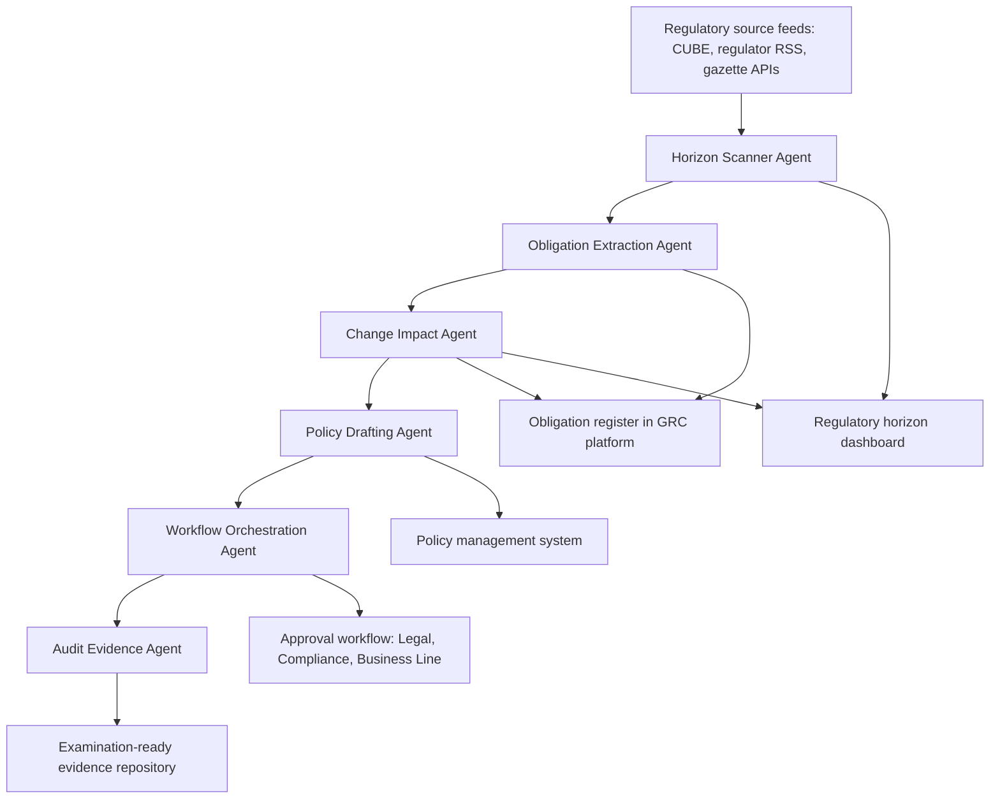

## What This Design Covers

This design covers an agentic AI platform that continuously monitors regulatory publications worldwide, extracts machine-readable obligations from regulatory text, maps them to a firm's control framework, drafts impact assessments and policy updates, and orchestrates the approval workflow through to audit-ready evidencing. The operating model is AI-assisted with mandatory human approval for policy changes and high-impact assessments. The design boundary includes the full regulatory change lifecycle from detection to evidencing but excludes regulatory lobbying, regulatory reporting/filing, and autonomous policy activation. The architecture draws on production patterns from CUBE RegPlatform (10,000+ issuing bodies, 750 jurisdictions), the Ascent/ING/CommBank MiFID II pilot (95% obligation extraction accuracy), and Wolters Kluwer Compliance Intelligence (launched October 2025). [S1][S2][S3][S4]

## Recommended Operating Model

| Decision Area | Recommendation |
|---------------|----------------|
| **Autonomy Model** | AI-autonomous for monitoring and extraction; AI-assisted with mandatory human review for applicability assessments, policy drafts, and implementation decisions. Low-impact, high-confidence changes (e.g., reporting format adjustments) flow with notification only. |
| **System of Record** | The firm's existing GRC platform (ServiceNow GRC, MetricStream, or RSA Archer) remains the authoritative obligation register and audit trail. The AI platform feeds structured outputs into the GRC, not the other way around. |
| **Human Decision Points** | Compliance officer reviews applicability assessments. Legal reviews interpretation of ambiguous provisions. Compliance committee or board risk committee approves policy changes. Business line heads approve operational changes. |
| **Primary Value Driver** | Compress the assessment-to-implementation cycle from 3-9 months to under 30 days by eliminating manual monitoring, automating obligation extraction, and pre-drafting impact assessments and policy updates for human review. [S2][S6] |

## Architecture

### System Diagram

### Component Responsibilities

| Component | Role | Notes |
|-----------|------|-------|
| Horizon Scanner Agent | Ingests regulatory publications from all applicable jurisdictions, classifies by relevance and urgency, and filters noise. | Mirrors CUBE's approach: structural, lexical, and NLP pre-processing across 80+ languages. [S1] |
| Obligation Extraction Agent | Parses regulatory text into discrete, machine-readable obligations with section-level traceability. | Ascent's 200-step AI pipeline achieved 95% accuracy on MiFID II obligation extraction in the ING/CommBank pilot. [S2][S3] |
| Change Impact Agent | Compares new obligations against the firm's existing register and control framework, identifies gaps, and drafts structured impact assessments with confidence scores. | Uses RAG over the firm's obligation register and policy corpus to ground assessments in internal context. |
| Policy Drafting Agent | Generates redline updates to affected policy and procedure documents, formatted to the firm's standards. | Drafts are review-ready, not final. Human compliance officers and legal counsel approve all policy changes. |
| Workflow Orchestration Agent | Routes assessments and drafts through the appropriate approval chain, tracks deadlines, and escalates overdue items. | Integrates with ServiceNow or equivalent workflow engine. CUBE's ServiceNow Connector maps obligations directly to policies, risks, and controls. [S11] |
| Audit Evidence Agent | Continuously assembles the audit trail linking each regulatory change to its assessment, approval, policy update, and training evidence. | Eliminates weeks of manual evidence assembly before regulatory examinations. |

## End-to-End Flow

| Step | What Happens | Owner |
|------|---------------|-------|
| 1 | Horizon Scanner Agent detects a new regulatory publication or amendment from an applicable jurisdiction within 24 hours of publication. | Horizon Scanner Agent |
| 2 | Obligation Extraction Agent parses the text into discrete obligations, tags each with jurisdiction, topic, effective date, and cross-references to existing instruments. | Obligation Extraction Agent |
| 3 | Change Impact Agent matches new obligations against the firm's register, identifies gaps and affected policies/controls, and drafts a structured impact assessment with confidence scoring. | Change Impact Agent + GRC platform |
| 4 | Compliance officer reviews the impact assessment, confirms applicability, and routes to Legal for interpretation of ambiguous provisions. High-confidence, low-impact changes may flow with notification only. | Compliance officer + Legal |
| 5 | Policy Drafting Agent generates redline updates to affected documents. Workflow Orchestration Agent routes drafts through approval. Audit Evidence Agent logs every step for examination readiness. | Policy Drafting + Workflow + Audit agents |

## AI Responsibilities and Boundaries

| Workflow Area | AI Does | Deterministic System Does | Human Owns |
|---------------|---------|---------------------------|------------|
| Regulatory monitoring | Scans all applicable sources continuously, classifies publications by relevance and urgency, filters irrelevant changes. | Enforces jurisdiction and license-perimeter filters. Delivers structured alerts via GRC integration. | Validates that no applicable jurisdictions are missing from the monitoring scope. |
| Obligation extraction | Parses regulatory text into discrete obligations with section-level traceability and confidence scores. | Stores obligations in the GRC register with version control and audit trail. | Reviews extracted obligations for accuracy, especially on novel or ambiguous regulatory instruments. |
| Impact assessment | Matches obligations to internal controls, identifies gaps, and drafts structured assessments with cited regulatory text. | Applies deadline and priority rules. Routes assessments through configured approval workflows. | Makes final applicability and materiality judgments. Approves or rejects assessments. |
| Policy drafting | Generates redline policy updates in the firm's document format, referencing the specific obligations that drive each change. | Applies document formatting, version control, and access permissions. | Reviews, edits, and approves all policy changes before activation. Legal reviews interpretation of ambiguous provisions. |

## Integration Seams

| System | Integration Method | Why It Matters |
|--------|--------------------|----------------|
| GRC platform (ServiceNow GRC, MetricStream, RSA Archer) | Bi-directional API via CUBE Connector or equivalent. Obligations, assessments, and evidence flow into the GRC as structured records. | The GRC is the system of record for obligations and audit trail. All AI outputs must land here to be examinable. [S11] |
| Regulatory intelligence feeds (CUBE RegPlatform, Wolters Kluwer) | Ingestion pipeline consuming structured regulatory feeds via API. CUBE provides pre-classified, multi-language regulatory content across 10,000+ issuing bodies. | Eliminates the need to build custom scrapers for thousands of regulator websites. CUBE's acquisition of Thomson Reuters RI consolidated the largest regulatory content library. [S1][S5] |
| Policy management system (PolicyHub, SharePoint) | Document API for reading current policies and writing redline drafts. | Policy Drafting Agent must access current policy text to generate accurate redlines. |
| Identity provider (Azure AD / Entra ID) | OIDC/SAML for authentication; role claims for approval-chain routing and access control. | Approval workflows must route to the correct role holders (compliance officer, legal counsel, business line head). |

## Control Model

| Risk | Control |
|------|---------|
| Missed regulatory change — a publication from an applicable jurisdiction is not detected | Dual-source monitoring: primary feed from CUBE/Wolters Kluwer plus secondary scraping of regulator RSS feeds. Weekly coverage reconciliation against the firm's jurisdiction register. |
| Obligation extraction error — AI misinterprets regulatory text or misses an obligation | Confidence scoring on every extracted obligation. Obligations below the confidence threshold require mandatory human review. Periodic back-testing against human-extracted baselines (target: 95% agreement). [S2][S3] |
| False applicability — AI flags a change as applicable when it is not, causing alert fatigue | Applicability model trained on the firm's regulatory perimeter (licensed activities, entity types, jurisdictions). False-positive rate monitored with a target of < 15%. |
| Unauthorized policy activation — AI-drafted policy goes live without human approval | Policy changes require explicit human approval in the workflow engine. No automated write-back to the policy management system without an approval record. |
| Confidentiality breach — obligation registers and gap assessments reveal control weaknesses | AI processing runs within the firm's tenant. No regulatory assessment data sent to external LLM providers for training. Enterprise API contracts with data-processing agreements. |

## Reference Technology Stack

| Layer | Default Choice | Reason | Viable Alternative |
|-------|----------------|--------|--------------------|
| **Model layer** | Azure OpenAI Service (GPT-4o for assessment drafting, GPT-4o-mini for classification/routing) + domain-specific SLMs for obligation extraction | Multi-model routing matches workload to capability. Domain-specific SLMs reduce hallucination on regulatory language — 4CRisk demonstrated this approach with specialized models trained on regulatory corpora. [S10] | Anthropic Claude for long-context regulatory document analysis; Cohere for multilingual embeddings. |
| **Orchestration** | LangGraph with a multi-agent coordinator pattern | Supports the six-agent architecture with conditional routing, state management, and human-in-the-loop approval gates. | CrewAI or Microsoft AutoGen for teams with existing expertise. |
| **Retrieval / memory** | Azure AI Search (hybrid dense + BM25 retrieval) over the firm's obligation register and policy corpus | Hybrid retrieval grounds impact assessments in the firm's actual controls and policies. Document-level security filters support multi-entity firms. | Elasticsearch with custom compliance metadata schema. |
| **Regulatory feed** | CUBE RegPlatform as primary structured feed | Largest coverage: 10,000+ issuing bodies, 750 jurisdictions, 80 languages. Acquired Thomson Reuters RI content library. [S1][S5] | Wolters Kluwer Compliance Intelligence; direct regulator API integrations for specific jurisdictions. [S4] |
| **Observability** | OpenTelemetry-based tracing with agent-level spans; Langfuse for prompt tracing | Every agent decision and LLM invocation must be traceable for regulatory examination. | LangSmith or Datadog LLM Observability. |

## Key Design Decisions

| Decision | Choice | Why It Fits This Use Case |
|----------|--------|---------------------------|
| Structured regulatory feeds over custom web scraping | Use CUBE RegPlatform or Wolters Kluwer as the primary ingestion source, not custom scrapers for each regulator website | Building and maintaining scrapers for 10,000+ issuing bodies across 80 languages is infeasible. CUBE's content library, augmented by the Thomson Reuters RI acquisition, provides the widest pre-classified regulatory corpus available. [S1][S5] |
| Domain-specific SLMs for obligation extraction, general LLMs for assessment drafting | Use specialized language models trained on regulatory corpora for extraction; use GPT-4o-class models for generating human-readable assessments | Obligation extraction requires precision on regulatory language — domain SLMs hallucinate less on this task than general LLMs. Assessment drafting benefits from general reasoning and natural language fluency. [S10][S12] |
| GRC platform as system of record, not the AI platform | All obligations, assessments, and evidence flow into the existing GRC; the AI platform is a processing layer, not a replacement | Regulatory examiners expect evidence in the GRC. Replacing the GRC introduces migration risk and audit discontinuity. The CUBE-ServiceNow connector demonstrates this pattern in production. [S11] |
| Confidence-gated human review rather than blanket review | High-confidence, low-impact changes flow with notification; low-confidence or high-impact changes require explicit human approval | Blanket review defeats the time-saving value proposition. Confidence gating lets compliance officers focus judgment on the changes that need it, consistent with Wolters Kluwer's approach of combining AI automation with human oversight. [S4] |
| Six-agent architecture with single orchestrator | Separate agents for scanning, extraction, assessment, drafting, workflow, and audit — coordinated by an orchestrator | Each stage has distinct inputs, outputs, and failure modes. Separating agents allows independent scaling, testing, and fallback. This pattern mirrors the architecture described by Icon Solutions for production regulatory change systems. [S9] |
