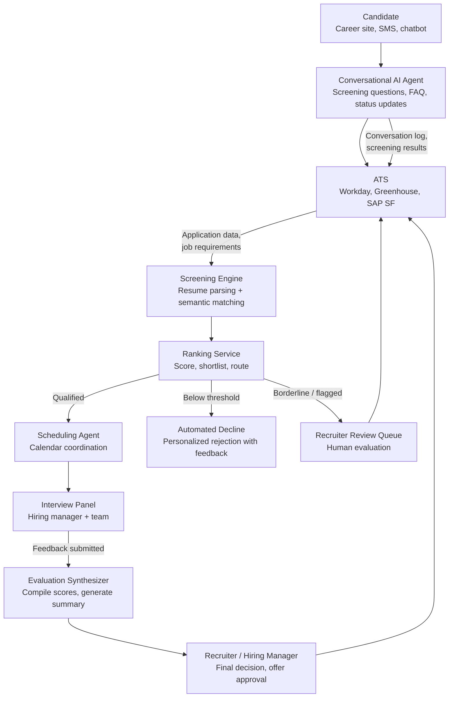

## What This Design Covers

This design covers an AI-driven talent acquisition system that automates resume screening, candidate engagement, interview scheduling, and evaluation synthesis for high-volume and professional hiring. The operating model keeps the applicant tracking system (ATS) as system of record, gives AI agents autonomy over screening and coordination, and reserves final hiring decisions for humans. The primary reference deployments are Unilever (1.8 million applications/year, 90% time-to-hire reduction), Chipotle (75% time-to-hire reduction across 3,500+ restaurants), and Compass Group (160,000 annual hires with a 20-person recruiting team using Paradox). [S1][S2][S3]

## Recommended Operating Model

| Decision Area | Recommendation |
|---------------|----------------|
| **Autonomy Model** | High autonomy for screening, scheduling, and candidate communication. AI agents parse resumes, rank candidates, coordinate interviews, and handle routine Q&A without human intervention. Recruiters focus on final-round interviews, offer decisions, and exceptions. [S1][S3] |
| **System of Record** | The ATS (Workday Recruiting, Greenhouse, SAP SuccessFactors, or iCIMS) remains authoritative for candidate records, pipeline stages, compliance audit trails, and reporting. AI agents read from and write back to the ATS via API. [S8] |
| **Human Decision Points** | Recruiters define job requirements and screening criteria. Hiring managers conduct final interviews and approve offers. Talent acquisition leadership reviews bias audit results and sets automation boundaries. [S7] |
| **Primary Value Driver** | Throughput and speed: screening 250+ applications per posting in seconds instead of hours, reducing time-to-fill from 42 days to under 14 days. Chipotle cut time-to-hire from 12 days to 3.5 days; Unilever cut from 4 months to 4 weeks for entry-level roles. [S1][S2] |

## Architecture

### System Diagram

### Component Responsibilities

| Component | Role | Notes |
|-----------|------|-------|
| Conversational AI Agent | Handles initial candidate interaction via SMS, web chat, or messaging apps. Conducts knockout screening questions, answers FAQs about role and company, provides application status updates. | Paradox (Olivia) processes 33% of conversations outside business hours. Compass Group uses this to maintain a 1:8,000 recruiter-to-hire ratio. [S3][S11] |
| Screening Engine | Parses resumes into structured data, extracts skills and experience, and performs semantic matching against job requirements using LLM embeddings. | Multi-agent parsing frameworks achieve 0.84 Pearson correlation with human evaluators. Replaces keyword-matching with semantic understanding of transferable skills. [S12] |
| Ranking Service | Scores and ranks candidates based on screening results, applies configurable thresholds, and routes to shortlist, decline, or human review queues. | Deterministic scoring rules enforce consistent treatment. Threshold configuration supports bias audit compliance. |
| Scheduling Agent | Coordinates interview scheduling across candidate and interviewer calendars, balances interviewer workload, and sends confirmations and reminders. | AI scheduling reduces coordination time by 85% and improves interview show rates by 20%. [S14] |
| Evaluation Synthesizer | Aggregates interview feedback from structured scorecards, identifies consensus and disagreements, and generates a hiring recommendation summary for the decision-maker. | Synthesizes across multiple interviewers. Flags missing scorecards and inconsistent ratings. |

## End-to-End Flow

| Step | What Happens | Owner |
|------|---------------|-------|
| 1 | Candidate applies via career site, SMS, or chatbot. Conversational AI agent acknowledges within minutes, collects basic information, and asks knockout screening questions. | Conversational AI Agent [S3] |
| 2 | Screening engine parses the resume into structured fields (skills, experience, education, certifications) and matches semantically against job requirements. Ranking service scores and shortlists. | Screening Engine + Ranking Service [S12] |
| 3 | Qualified candidates receive interview invitations. Scheduling agent reads interviewer calendars, proposes slots, confirms bookings, and sends reminders. Declined candidates receive personalized feedback. | Scheduling Agent |
| 4 | Interview panel conducts interviews. Structured scorecards are submitted to the ATS. Evaluation synthesizer compiles feedback into a decision-ready summary. | Interview Panel + Evaluation Synthesizer |
| 5 | Recruiter or hiring manager reviews the synthesized evaluation and makes the hire/no-hire decision. Offer approval follows existing organizational workflow. Full audit trail is logged in the ATS. | Recruiter / Hiring Manager [S7] |

## AI Responsibilities and Boundaries

| Workflow Area | AI Does | Deterministic System Does | Human Owns |
|---------------|---------|---------------------------|------------|
| Candidate intake and engagement | Conducts conversational screening, answers FAQs, provides real-time status updates via SMS/chat. [S3][S11] | ATS stores candidate records, enforces pipeline stage rules, and generates compliance reports. | Handles sensitive escalations, accommodation requests, and complaints. |
| Resume screening and ranking | Parses resumes into structured data, performs semantic matching, scores and ranks candidates against requirements. [S12] | Ranking thresholds and routing rules are configured deterministically. EEOC four-fifths rule checks run on aggregate outcomes. [S7] | Reviews borderline candidates, overrides AI recommendations, approves screening criteria. |
| Interview scheduling | Coordinates calendars, balances interviewer load, sends confirmations and reminders, reschedules on conflicts. | Calendar system enforces availability windows and booking rules. | Conducts the interview. Decides on panel composition. |
| Evaluation synthesis | Aggregates structured feedback, identifies scoring patterns, generates hiring recommendation summary. | Scoring rubric normalizes ratings across interviewers. | Makes final hire/no-hire decision. Approves compensation and offer terms. |

## Integration Seams

| System | Integration Method | Why It Matters |
|--------|--------------------|----------------|
| ATS (Workday Recruiting, Greenhouse, SAP SuccessFactors) | REST API with OAuth 2.0 (Workday, iCIMS) or HTTP Basic Auth (Greenhouse). Greenhouse supports native webhooks with HMAC SHA-256 verification; Workday requires polling. [S8] | System of record for all candidate data. Every AI action must write back to the ATS to maintain a single source of truth and a complete compliance audit trail. |
| Calendar (Google Calendar, Microsoft 365) | Calendar API for availability reads and booking writes | Scheduling agent needs real-time interviewer availability. Calendar integration eliminates the back-and-forth that accounts for most scheduling delay. |
| Messaging gateway (SMS / web chat) | Twilio or equivalent for SMS; WebSocket for embedded chat | Conversational AI operates through the candidate's preferred channel. SMS-first design is critical for hourly and frontline roles where candidates lack desktop access. [S3] |
| HRIS (Workday HCM, SAP SuccessFactors) | API event trigger on hire decision | Onboarding workflow initiates automatically when a candidate is marked as hired. Eliminates handoff delay between recruiting and HR operations. |

## Control Model

| Risk | Control |
|------|---------|
| Adverse impact / bias in screening outcomes | Regular bias audits measuring selection rates by race, ethnicity, and sex per EEOC four-fifths rule. NYC Local Law 144 requires independent audit within one year of deployment and published impact ratios. EU AI Act classifies recruiting AI as high-risk with mandatory bias testing by August 2026. [S5][S6][S7] |
| Hallucinated or fabricated candidate qualifications during parsing | Structured extraction with JSON schema validation. Every parsed field traces back to a specific resume section. No free-text generation in screening — only extraction and classification. [S12] |
| Candidate data exposure | PII encrypted at rest and in transit. Role-based access controls. Data retention policies aligned with GDPR and CCPA. Background: McDonald's McHire breach (June 2025) exposed 64M records due to default credentials — credential management is non-negotiable. [S4] |
| Candidate experience degradation | Real-time satisfaction monitoring. Human escalation path available at every interaction point. Candidates must be notified that AI is being used (required by Illinois AIPA and EU AI Act). [S6][S13] |
| Regulatory non-compliance across jurisdictions | Compliance rule engine that adapts disclosure, consent, and audit requirements by jurisdiction. Separate configurations for NYC LL144, Illinois AIPA, EU AI Act, and EEOC requirements. [S5][S6][S13] |

## Reference Technology Stack

| Layer | Default Choice | Reason | Viable Alternative |
|-------|----------------|--------|--------------------|
| **Model layer** | GPT-4 class LLM for resume parsing, semantic matching, and conversational engagement + embedding model for vector similarity | Resume parsing needs structured extraction from unstructured text. Conversational engagement needs natural language fluency. Multi-agent frameworks using GPT-4o achieve 0.84 correlation with human evaluators. [S12] | Claude for parsing and engagement; fine-tuned compact models (0.6B parameters) for high-volume classification; Eightfold's proprietary deep-learning models for skills matching. [S9] |
| **Orchestration** | Event-driven pipeline triggered by ATS webhook events (new application, stage change, feedback submitted) | Recruiting workflows are inherently event-driven — each candidate action triggers the next step. Event-based orchestration scales naturally with application volume. [S8] | Temporal for durable execution with retry guarantees; LangGraph for teams building custom multi-agent workflows. |
| **Retrieval / memory** | Vector store (ChromaDB or Pinecone) with embeddings for job-candidate semantic matching + conversation history in the ATS | Semantic matching outperforms keyword search for identifying transferable skills and non-obvious qualifications. Conversation state must persist across multi-day candidate journeys. [S12] | PostgreSQL with pgvector for teams preferring a single database; Elasticsearch for hybrid keyword + vector search. |
| **Observability** | Pipeline dashboards tracking time-to-fill, screening accuracy, scheduling completion rate, candidate satisfaction, and bias metrics | Bias monitoring is a regulatory requirement, not optional. Time-to-fill and satisfaction are the primary business health signals. [S5][S7] | OpenTelemetry for distributed tracing; Datadog or Grafana for visualization; custom bias dashboards for compliance reporting. |

## Key Design Decisions

| Decision | Choice | Why It Fits This Use Case |
|----------|--------|---------------------------|
| Conversational-first intake via SMS/chat, not portal-only application | Candidates interact through text messages or embedded chat rather than multi-page web forms | Application completion rates jump from 50% to 85% with conversational intake. Critical for hourly/frontline roles where candidates apply from mobile devices. Chipotle and Compass Group both use this pattern. [S2][S3] |
| LLM-based semantic matching, not keyword/boolean search | Resume screening uses language model embeddings to match candidates to requirements based on meaning, not keyword overlap | Keyword matching misses candidates with transferable skills or non-standard job titles. Semantic matching achieves 0.84 correlation with human evaluators versus 0.5–0.6 for keyword approaches. [S12] |
| Human-in-loop for final decisions, not fully autonomous hiring | AI screens, ranks, schedules, and synthesizes — but a human makes every hire/no-hire decision | Regulatory frameworks (EU AI Act, EEOC) require meaningful human oversight of employment decisions. Full autonomy also creates unacceptable legal liability for adverse impact claims. [S6][S7] |
| Jurisdiction-aware compliance engine, not one-size-fits-all | Separate compliance configurations per jurisdiction covering disclosure, consent, audit, and notification requirements | NYC LL144, Illinois AIPA, EU AI Act, and EEOC each impose different obligations. A single compliance model will violate at least one. Chipotle's multi-state rollout demonstrates the need for jurisdictional flexibility. [S2][S5][S6][S13] |
| Modular agent architecture with specialized agents, not a monolithic screening tool | Separate agents for conversation, screening, scheduling, and evaluation synthesis | Each function has different latency requirements, failure modes, and scaling characteristics. Screening must process in seconds; scheduling can take minutes. Isolation enables independent improvement and failure containment. |
