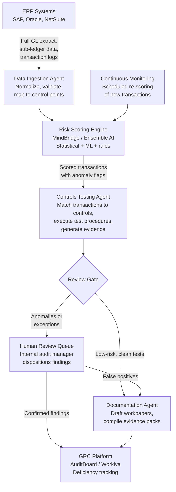

## What This Design Covers

This design covers an agentic AI system that replaces sampling-based audit testing with continuous, full-population transaction analysis, automated controls testing, anomaly detection, and audit documentation generation. The operating model pairs an AI-powered risk scoring and anomaly detection engine (MindBridge or equivalent) with an LLM-based documentation and evidence agent, layered on top of the organization's ERP and GRC platforms. The design boundary includes internal audit controls testing (SOX 404 ICFR), journal entry analysis, and audit workpaper generation. External audit opinion work, tax audit, and IT general controls testing remain outside the first release. The architecture draws on published deployments from EY (1.4 trillion journal entry lines per year across 160,000 engagements), KPMG Clara AI (95,000 auditors globally), and MindBridge (260 billion+ transactions analyzed across 3,000+ ERP systems). [S1][S2][S3]

## Recommended Operating Model

| Decision Area | Recommendation |
|---------------|----------------|
| **Autonomy Model** | Full autonomy for data ingestion, risk scoring, and anomaly flagging across 100% of transactions. High autonomy for generating draft audit workpapers and controls testing documentation. Human approval required for all audit conclusions, exception dispositions, deficiency classifications, and management letter findings. The PCAOB position is clear: AI improves audit quality, but the human element cannot be removed. [S6] |
| **System of Record** | The ERP (SAP, Oracle, NetSuite) remains authoritative for transaction data and GL balances. The GRC platform (AuditBoard, Workiva, or ServiceNow) remains the system of record for control definitions, test results, and deficiency tracking. The AI platform is an analysis and evidence layer, not a replacement for either. [S5] |
| **Human Decision Points** | Internal audit managers review and disposition all AI-flagged anomalies. Control owners confirm control operating effectiveness based on AI-generated evidence. The CAE approves deficiency classifications (significant deficiency, material weakness). External auditors independently assess AI-generated evidence before relying on it. [S6][S10] |
| **Primary Value Driver** | Coverage and labor reallocation. Moving from 2-8% sample testing to 100% transaction analysis eliminates the statistical risk of missed control failures. The KPMG 2025 SOX Survey shows organizations spend an average of $2.3M and 15,580 hours annually on SOX programs, with only 17% of controls automated. AI targets the 45% of controls that remain fully manual. [S5] |

## Architecture

### System Diagram

### Component Responsibilities

| Component | Role | Notes |
|-----------|------|-------|
| Data Ingestion Agent | Extracts full-population transaction data from the ERP, normalizes across entities and chart-of-accounts structures, validates completeness against GL trial balance totals, and maps transactions to the relevant SOX control points. | MindBridge supports 3,000+ ERP system formats with LLM-driven data ingestion. GPU-accelerated processing cuts validation time by 4x per the Q2 2025 release. [S3][S9] |
| Risk Scoring Engine | Scores every transaction using an ensemble of statistical models (Benford's Law, regression), unsupervised ML (clustering, isolation forests for anomaly detection), and business rules (GAAP-based thresholds). Produces a per-transaction risk score and flags outliers for human review. | MindBridge uses this three-layer ensemble approach across 8,000+ embedded GAAP rules. The combination reduces false positives compared to any single method alone. [S3] |
| Controls Testing Agent | Maps scored transactions to specific SOX controls, executes automated test procedures (three-way match, threshold checks, segregation-of-duties validation, approval workflow verification), and compiles test evidence with pass/fail results. | Automates the 16 hours per control currently spent on test-of-effectiveness procedures (KPMG SOX Survey FY24 average). [S5] |
| Documentation Agent | Generates draft audit workpapers from test results, compiles evidence packs with supporting transaction detail, and produces exception summaries for reviewer queues. Uses structured LLM output constrained to the firm's workpaper templates. | EY, KPMG, and Deloitte all deploy LLM-based documentation generation within their audit platforms. KPMG Clara AI generates process narratives and flowcharts from walkthrough data. [S1][S2][S4] |
| Continuous Monitoring | Runs risk scoring on new transactions on a scheduled cadence (daily or weekly) rather than waiting for period-end testing. Alerts when anomaly volumes or risk scores trend above baseline thresholds. | Genpact-MindBridge partnership specifically targets continuous controls monitoring as a core capability. [S9] |

## End-to-End Flow

| Step | What Happens | Owner |
|------|---------------|-------|
| 1 | At the start of each audit period, the data ingestion agent extracts the full GL, sub-ledger transactions, and supporting detail from ERP systems. It validates completeness by reconciling extracted totals to the trial balance. | Data Ingestion Agent |
| 2 | The risk scoring engine analyzes 100% of transactions using the ensemble AI approach. Each transaction receives a composite risk score. Transactions scoring above the risk threshold are flagged as anomalies requiring human review. | Risk Scoring Engine [S3] |
| 3 | The controls testing agent maps flagged and unflagged transactions to the organization's SOX control matrix. For each in-scope control, it executes the defined test procedure automatically — verifying approvals, matching documents, checking thresholds, and validating segregation of duties. | Controls Testing Agent |
| 4 | Clean test results (no exceptions, low risk score) flow to the documentation agent, which drafts workpapers and compiles evidence. Exceptions and anomalies route to the human review queue with supporting context and the AI's risk rationale. | Documentation Agent + Review Gate |
| 5 | Internal audit managers review exceptions, confirm or dismiss anomalies, classify any deficiencies, and update the GRC platform. The CAE reviews aggregate results and approves the final audit report. External auditors assess AI-generated evidence per their own professional standards. | Internal Audit Manager / CAE [S6][S10] |

## AI Responsibilities and Boundaries

| Workflow Area | AI Does | Deterministic System Does | Human Owns |
|---------------|---------|---------------------------|------------|
| Transaction analysis | Scores 100% of transactions for risk. Detects anomalies using statistical, ML, and rules-based methods. Identifies patterns across entities and periods that sampling would miss. [S3] | ERP enforces transaction controls (approval workflows, posting rules, access controls). GRC platform maintains the control matrix and test plan definitions. | Reviews and dispositions all AI-flagged anomalies. Determines whether an anomaly represents a control failure, an acceptable exception, or a false positive. |
| Controls testing | Executes automated test procedures: three-way match, threshold verification, approval chain validation, segregation-of-duties checks. Generates pass/fail results with evidence. | GRC platform defines control objectives, test procedures, and sample parameters. ERP access controls enforce authorization boundaries. | Approves test conclusions. Classifies deficiencies (control deficiency, significant deficiency, material weakness). Determines remediation requirements. |
| Documentation | Drafts workpapers from structured test results. Compiles evidence packs. Generates exception summaries and trending analysis. [S2][S4] | Workpaper management system enforces templates, version control, and review sign-off workflows. | Reviews and approves all workpapers. Ensures documentation meets PCAOB or IIA standards. Signs off on final audit report. [S6][S10] |

## Integration Seams

| System | Integration Method | Why It Matters |
|--------|--------------------|----------------|
| ERP (SAP, Oracle, NetSuite) | Batch extraction via standard APIs (SAP OData, Oracle REST, NetSuite SuiteQL) or direct database read for full GL and sub-ledger data. MindBridge supports 3,000+ ERP formats natively. [S3] | The ERP is the source of truth for all financial transactions. Full-population extraction is the foundation of 100% testing — incomplete data makes the entire analysis unreliable. |
| GRC Platform (AuditBoard, Workiva, ServiceNow GRC) | Bidirectional API: pull control definitions and test plans; push test results, evidence, and deficiency records. KPMG SOX Survey shows 68% of organizations use GRC technology, led by Workiva (39%) and AuditBoard (37%). [S5] | The GRC platform owns the control matrix, test plan, and deficiency lifecycle. AI-generated test results must flow into the existing compliance workflow, not create a parallel system. |
| Cloud Data Platforms (Databricks, Microsoft Fabric, Snowflake) | MindBridge integrates with Databricks, Microsoft Fabric, and Snowflake for organizations that centralize financial data in a lakehouse. [S9] | Enterprises with modern data architectures may already have ERP data in a lakehouse. Direct integration avoids redundant extraction and keeps the AI platform working on the freshest data. |
| Audit Management Platform (EY Canvas, KPMG Clara, Deloitte Omnia) | For organizations using Big Four audit platforms, AI capabilities are embedded natively. EY Canvas processes 1.4T journal entry lines/year. KPMG Clara serves 95,000 auditors on Azure. [S1][S2] | External audit firms increasingly require AI-generated evidence to be produced within or compatible with their own platforms. Integration avoids duplicate work between internal and external audit. |

## Control Model

| Risk | Control |
|------|---------|
| AI flags too many false positives, overwhelming reviewers and eroding trust | Ensemble approach (statistical + ML + rules) reduces false positives versus any single method. Risk score thresholds are tunable per control area. Weekly false-positive-rate tracking with target below 15%. [S3] |
| AI misses a material anomaly that sampling would also miss (false negative) | 100% transaction coverage is inherently more comprehensive than sampling. Benford's Law, regression, and clustering detect different anomaly types — the ensemble catches what any single method misses. Periodic back-testing against known historical exceptions validates detection rates. [S3] |
| AI-generated workpapers contain inaccurate statements or fabricated evidence | Documentation agent uses structured output constrained to test results and extracted transaction data — it summarizes evidence, not generates claims. All workpapers require human review and sign-off before finalization. [S6] |
| Regulatory rejection of AI-generated audit evidence | PCAOB TIA working group recommends structured audit documentation standards and risk management frameworks for AI use. The IIA's 2025 Global Internal Audit Standards require professional judgment over all conclusions. AI evidence is supporting, not conclusive. [S6][S10] |
| Data extraction is incomplete, causing AI to score on partial data | Ingestion agent reconciles extracted transaction counts and amounts to GL trial balance before scoring begins. Any reconciliation gap above tolerance halts the analysis and alerts the audit team. |

## Reference Technology Stack

| Layer | Default Choice | Reason | Viable Alternative |
|-------|----------------|--------|--------------------|
| **Model layer** | MindBridge ensemble AI (statistical + ML + business rules) for transaction risk scoring and anomaly detection. Claude or GPT-4 class model for workpaper drafting and evidence summarization. | MindBridge is purpose-built for financial data with 260B+ transactions of training history and 8,000+ GAAP rules. General LLMs handle the unstructured documentation tasks. [S3] | Big Four embedded platforms (EY Canvas AI, KPMG Clara AI, Deloitte Omnia) for organizations already in those ecosystems. [S1][S2][S4] |
| **Orchestration** | Temporal or Apache Airflow for scheduled data extraction, scoring, and testing workflows. Event-driven triggers for continuous monitoring runs. | Audit workflows are batch-oriented with period-end peaks. Temporal handles multi-step pipelines with retry logic and state tracking. Continuous monitoring adds event-driven scheduling between periods. |
| **Retrieval / memory** | Vector store (Pinecone or Azure AI Search) for audit guidance retrieval. Structured database for transaction data, scores, and test results. | The documentation agent needs RAG access to accounting standards and firm methodology. Transaction data stays in structured storage for deterministic querying — vector search is only for guidance retrieval. [S2] |
| **Observability** | OpenTelemetry for agent tracing. GRC platform dashboards for control test status and deficiency tracking. Anomaly volume trending. | Every AI-driven test must be auditable. Tracing from data extraction through scoring, testing, and documentation provides the evidence chain that regulators and external auditors require. [S6] |

## Key Design Decisions

| Decision | Choice | Why It Fits This Use Case |
|----------|--------|---------------------------|
| Ensemble AI for risk scoring rather than a single model | MindBridge-style three-layer approach: statistical methods, unsupervised ML, and business rules | No single technique catches all anomaly types. Benford's Law detects fabricated amounts, clustering detects unusual patterns, and business rules catch known GAAP violations. The ensemble produces explainable, defensible results — critical for audit evidence. [S3] |
| 100% transaction testing as the default, not enhanced sampling | Analyze and score every transaction rather than selecting larger samples | The KPMG SOX Survey shows only 17% of controls are automated and testing hours per control increased 33% over two years. Sampling is the root cause of missed control failures — a sample of 2 items from a monthly control has an 83% probability of missing a single failure. Full-population testing eliminates this statistical gap. [S5] |
| AI generates evidence; humans make all audit conclusions | AI produces scored transactions, test results, and draft documentation. All deficiency classifications and audit opinions remain human decisions. | PCAOB and IIA standards require professional judgment for audit conclusions. The PCAOB's TIA working group explicitly states that AI cannot replace the human element. This boundary protects regulatory compliance and audit defensibility. [S6][S10] |
| Start with internal audit SOX controls testing, defer external audit | Phase 1 targets internal audit teams testing ICFR controls. External audit evidence sharing comes in a later phase. | Internal audit controls the test plan, methodology, and tools. External auditors have their own AI platforms (EY Canvas, KPMG Clara, Deloitte Omnia) and will independently assess any AI-generated evidence. Starting internally avoids cross-firm platform conflicts. [S1][S2][S4] |
