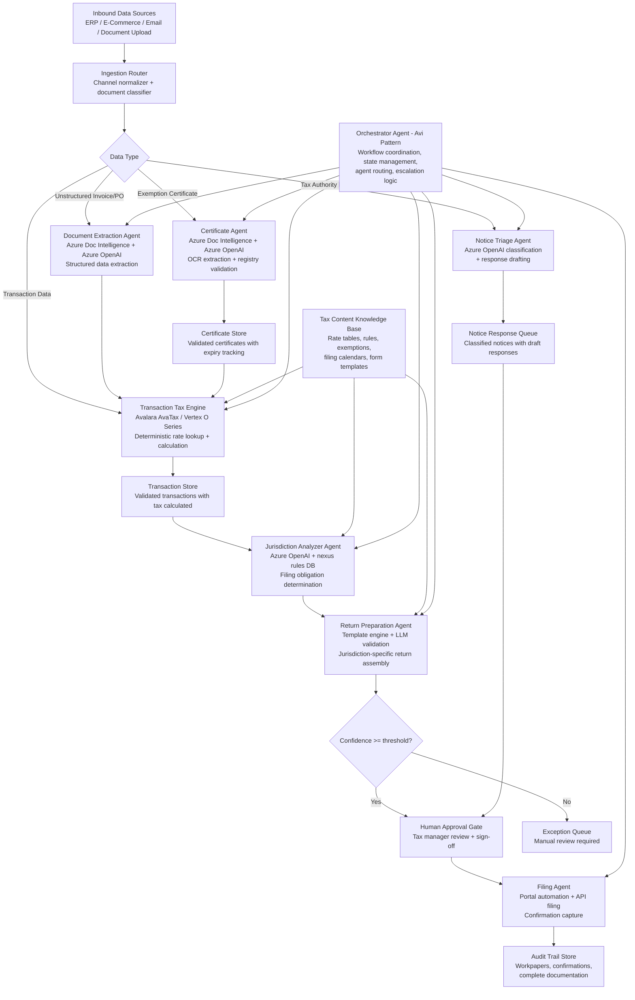

# UC-025: Autonomous Multi-Jurisdiction Tax Compliance and Filing with Agentic AI — Solution Design

## Solution Overview

The critical architectural insight for tax compliance AI is that tax rate calculation and return math must remain deterministic — never delegated to an LLM. Avalara's production system processes billions of transactions across 190+ countries with 15-millisecond response times using a deterministic tax engine backed by expert-verified rate databases covering 12,000+ U.S. jurisdictions and 20,000+ globally (Vertex). LLMs enter the picture for tasks that previously required human judgment on unstructured data: parsing exemption certificates, classifying tax authority notices, extracting transaction data from non-standard sources, and generating audit workpapers. Thomson Reuters' ONESOURCE Sales and Use Tax AI demonstrates this hybrid pattern — CoCounsel (their LLM layer) orchestrates data import, validation, and return mapping while deterministic tax content provides the actual rates and rules. [CS1][CS2][CS3]

The recommended design is a **multi-agent orchestrator-worker system with a deterministic tax engine core**. An LLM-powered orchestrator (modeled after Avalara's Avi agent) coordinates specialized worker agents: a Document Extraction Agent processes unstructured inputs (invoices, exemption certificates, authority notices) using Azure Document Intelligence and Azure OpenAI structured outputs; a Jurisdiction Analyzer Agent determines nexus obligations and filing requirements; a Return Preparation Agent assembles validated transaction data into jurisdiction-specific return formats; a Filing Agent automates portal submission and confirmation capture; and a Notice Triage Agent classifies and drafts responses to tax authority correspondence. The deterministic tax engine (Avalara AvaTax API, Vertex O Series, or equivalent) handles all rate lookups, taxability determinations, and calculation logic — the LLM never computes tax amounts. [CS1][CS4][CS5]

This separation is deliberate: in a domain where 800+ rate changes occur annually across U.S. jurisdictions alone, and where every filing position must be audit-defensible, the LLM handles language understanding and document reasoning while the tax engine provides authoritative, version-controlled tax content. Avalara's ALFA framework (Avalara LLM Framework for Agentic Applications) embodies this principle — enterprise LLMs from Amazon, Anthropic, Google, Meta, Microsoft, and OpenAI are paired with proprietary small language models tuned on billions of compliance data points, with guardrails and RAG databases providing domain grounding. [CS1][CS6]

---

## Architecture

### Architecture Diagram



### Component Overview

| # | Component | Technology / Service | Role |
|---|-----------|----------------------|------|
| 1 | Orchestrator agent | LangGraph StateGraph + Azure OpenAI GPT-4o | Routes tasks to specialized agents, manages workflow state, handles escalation logic. Modeled on Avalara's Avi orchestrator pattern. [CS1][CS6] |
| 2 | Transaction tax engine | Avalara AvaTax API / Vertex O Series API | Deterministic tax rate lookup and calculation across 12,000+ U.S. and 20,000+ global jurisdictions. Handles taxability, exemptions, rate application. Never uses LLM for math. [CS4][CS5] |
| 3 | Document extraction agent | Azure Document Intelligence + Azure OpenAI structured outputs | Extracts structured data from unstructured invoices, purchase orders, and receipts. Uses prebuilt tax document models for W-2s, 1099s, 1098s. [CS7] |
| 4 | Certificate validation agent | Azure Document Intelligence + Azure OpenAI + state registry APIs | OCR extraction from exemption certificates, cross-verification against state registries, expiry tracking, and follow-up generation. [CS1] |
| 5 | Jurisdiction analyzer agent | Azure OpenAI + nexus rules database | Determines filing obligations based on economic nexus thresholds, physical presence rules, and transaction patterns. Uses RAG over jurisdiction-specific rule corpus. [CS1][CS2] |
| 6 | Return preparation agent | Template engine + Azure OpenAI validation | Assembles validated transaction data into jurisdiction-specific return formats. LLM validates completeness and flags anomalies against prior-period returns. [CS2][CS3] |
| 7 | Filing agent | Portal automation (Playwright/Selenium) + e-filing APIs | Submits returns via electronic filing APIs (33 U.S. states + Canada via Thomson Reuters) or automated portal navigation. Captures confirmations. [CS3] |
| 8 | Notice triage agent | Azure OpenAI classification + response generation | Classifies incoming tax authority notices by type and urgency, extracts key dates and requirements, drafts initial responses. [CS1] |
| 9 | Tax content knowledge base | Vector store (Azure AI Search) + deterministic rate database | Hybrid store: vector index over tax rules, regulations, and guidance for RAG; deterministic tables for rates, forms, and filing calendars. [CS1][CS4] |
| 10 | Audit trail store | Azure Cosmos DB / SQL | Immutable record of every transaction, calculation, filing, and agent decision with full provenance chain. [CS3] |

---

## Data Flow

```
1. [Trigger]   → Transaction lands in ERP (SAP S/4HANA, Oracle, NetSuite, Dynamics 365)
                  or document arrives (email, upload, scan)
2. [Ingest]    → Ingestion router normalizes data format and classifies input type
                  (transaction, certificate, notice, unstructured document)
3. [Extract]   → Document Extraction Agent uses Azure Doc Intelligence + Azure OpenAI
                  to convert unstructured inputs to structured transaction records
4. [Calculate] → Transaction Tax Engine (Avalara/Vertex) applies deterministic rate
                  lookup: jurisdiction → product taxability → exemption status → rate → tax amount
                  Response in ~15ms per transaction (Avalara benchmark)
5. [Analyze]   → Jurisdiction Analyzer Agent evaluates nexus exposure and filing
                  obligations based on accumulated transaction patterns
6. [Prepare]   → Return Preparation Agent assembles transactions into jurisdiction-specific
                  return formats, validates against prior periods, generates workpapers
7. [Review]    → Returns exceeding confidence threshold route to Human Approval Gate;
                  returns below threshold route to Exception Queue for manual review
8. [File]      → Filing Agent submits approved returns via e-filing APIs or portal automation,
                  captures confirmation numbers, records payment remittance
9. [Document]  → Audit Trail Store captures complete provenance: source data, calculations,
                  agent reasoning traces, approval records, filing confirmations
```

---

## Agent Pattern

| Aspect               | Choice                                   |
|----------------------|------------------------------------------|
| **Pattern**          | Multi-Agent Orchestrator-Worker with Deterministic Core |
| **Orchestration**    | Graph-based (LangGraph StateGraph) with event-driven triggers for filing deadlines |
| **Human-in-the-Loop**| Approval Gate before filing + Escalation for low-confidence returns and novel scenarios |
| **State Management** | Persistent State (transaction lifecycle tracked from ingestion through filing confirmation) |
| **Autonomy Level**   | Semi-Autonomous (autonomous through preparation; human approval required before filing and payment) |

### Why This Pattern?

**Multi-agent over single-agent**: Tax compliance spans fundamentally different cognitive tasks — OCR/extraction, rule-based calculation, document assembly, portal automation, and natural language triage. No single agent prompt can handle this range effectively. Avalara's production architecture uses "a coordinated network of purpose-built AI agents" for exactly this reason — each agent owns a narrow domain and can be independently tested, updated, and audited. [CS1]

**Deterministic core over LLM-for-everything**: Tax calculations must be reproducible, auditable, and legally defensible. An LLM cannot guarantee identical output for the same input, making it unsuitable for rate application and tax math. The hybrid approach — LLM for language understanding, deterministic engine for calculation — is the universal pattern across Avalara, Thomson Reuters, Vertex, and Wolters Kluwer. By late 2025, nearly 800 documented cases of AI citation hallucination across 25+ countries reinforced why tax positions cannot rely on LLM generation alone. [CS1][CS2][CS3][CS4][CS5][CS8]

**Graph-based orchestration over sequential pipeline**: The filing lifecycle is not strictly linear — notices can arrive at any time, certificates expire asynchronously, nexus obligations change with each transaction. LangGraph's StateGraph allows conditional branching (e.g., skip return preparation if no filing obligation exists), parallel execution (e.g., process certificates and transactions simultaneously), and interrupt-resume for human approval gates. [CS9]

**Approval gate over full autonomy**: Corporate governance frameworks universally require human sign-off on tax filings. Even Avalara's most automated agents include "built-in checkpoints for human review." The system maximizes automation up to the approval point, then makes human review efficient by presenting pre-validated returns with anomaly flags. [CS1][CS6]

### Alternatives Considered

| Alternative | Pros | Cons | Why Not Chosen |
|-------------|------|------|----------------|
| Single LLM agent with tools | Simpler architecture, lower latency | Cannot handle breadth of tasks; prompt too large; LLM math unreliable for tax | Tax calculation requires deterministic engine; scope too broad for single agent |
| Pure deterministic rules engine (no LLM) | Maximum auditability, no hallucination risk | Cannot process unstructured documents, certificates, or notices; requires manual data entry | The unstructured-to-structured gap is exactly where LLM adds value |
| RAG-only approach | Good for tax research and guidance | Insufficient for end-to-end workflow automation; retrieval alone doesn't execute filings | RAG is a component (for jurisdiction rules lookup) but not the full solution |
| Fully autonomous (no human approval) | Maximum efficiency, lowest latency | Unacceptable compliance risk; no corporate governance framework allows unsupervised tax filings | Regulatory and governance constraints require human sign-off |

---

## Integration Points

| System | Integration Method | Direction | Purpose |
|--------|--------------------|-----------|---------|
| SAP S/4HANA | SAP BTP connector / REST API | Bidirectional | Read transaction data, write tax amounts back to GL. Avalara provides pre-built SAP integrations via BTP. [CS4] |
| Oracle Cloud ERP | REST API / Oracle Integration Cloud | Bidirectional | Transaction data extraction and tax amount posting |
| NetSuite | SuiteTalk REST API / Avalara Avi for NetSuite | Bidirectional | Native connector for transaction data and tax calculation results. [CS6] |
| Microsoft Dynamics 365 | Dataverse API | Bidirectional | Transaction ingestion and tax posting |
| Shopify / Magento / WooCommerce | Platform REST APIs | Read | E-commerce transaction data for sales tax calculation |
| Avalara AvaTax | REST API (AvaTax v2) | Bidirectional | Tax calculation, address validation, taxability determination. [CS4] |
| Vertex O Series | REST API / SOAP | Bidirectional | Alternative tax calculation engine. [CS5] |
| State tax authority portals | Playwright browser automation / e-filing APIs | Write | Return filing and confirmation capture. 33 states + Canada support e-filing via Thomson Reuters. [CS3] |
| State exemption registries | REST API / web scraping | Read | Exemption certificate validation against authoritative registries |
| Azure Document Intelligence | REST API | Read | OCR and structured extraction from tax documents (W-2, 1099, certificates). Prebuilt tax document models. [CS7] |
| Email (Microsoft 365 / Gmail) | Graph API / Gmail API | Read | Inbound notice ingestion, certificate receipt. Avalara Avi for Outlook demonstrates this pattern. [CS6] |
| Azure AI Search | REST API / SDK | Read | Vector search over tax rules and regulations for RAG-powered jurisdiction analysis |

---

## Tools & Frameworks

### AI / ML Stack

| Component | Technology | Why Chosen |
|-----------|-----------|------------|
| **LLM Provider** | Azure OpenAI Service | Enterprise compliance (SOC 2, data residency), private endpoints, content filtering. Avalara's ALFA framework integrates with Azure among other providers. [CS6] |
| **Primary Model** | GPT-4o | Best reasoning for document extraction and classification tasks; structured output support for reliable JSON extraction |
| **Secondary Model** | GPT-4o-mini | Lower cost for high-volume tasks: certificate OCR validation, notice classification, routine data mapping |
| **Agent Framework** | LangGraph (Python) | Graph-based state management with conditional branching, human-in-the-loop interrupts, and persistent checkpointing — critical for multi-step compliance workflows. [CS9] |
| **Document Intelligence** | Azure Document Intelligence (prebuilt tax models) | Prebuilt models for W-2, 1099, 1098; custom models for exemption certificates. Superior OCR accuracy on tax forms. [CS7] |
| **Vector Database** | Azure AI Search | Hybrid search (vector + keyword) over tax rules and regulations; managed service with Azure AD integration |
| **Embedding Model** | text-embedding-3-large | 3,072 dimensions for high-fidelity semantic search over nuanced tax regulatory text |

### Infrastructure Stack

| Component | Technology | Why Chosen |
|-----------|-----------|------------|
| **Compute** | Azure Container Apps | Serverless scaling for variable filing workloads (burst during month-end/quarter-end) |
| **Storage** | Azure Cosmos DB | Multi-region, immutable audit trail for transaction and filing records |
| **Message Queue** | Azure Service Bus | Reliable async processing for filing jobs, notice ingestion, certificate validation |
| **Monitoring** | Azure Application Insights | Integrated with Azure Container Apps; custom metrics for agent performance tracking |

### Open Source / Third Party

| Component | Technology | Why Chosen |
|-----------|-----------|------------|
| **Browser Automation** | Playwright | Portal filing automation for jurisdictions without e-filing APIs; headless browser for server-side execution |
| **PDF Generation** | WeasyPrint / ReportLab | Return form generation for jurisdictions requiring PDF submission |
| **Task Scheduling** | APScheduler / Azure Logic Apps | Filing deadline monitoring and automated workflow triggers |

---

## Security & Compliance

| Concern | Approach |
|---------|----------|
| **Authentication** | Managed Identity for Azure services; OAuth 2.0 for ERP API connections; per-jurisdiction credential vault for tax authority portals |
| **Authorization** | RBAC with role separation: agents can prepare but not file; tax managers approve filings; admins configure jurisdiction rules |
| **Data at Rest** | AES-256 encryption with customer-managed keys (Azure Key Vault); tax data classified as Confidential |
| **Data in Transit** | TLS 1.3 for all API calls; Private Endpoints for Azure OpenAI and Document Intelligence to keep data off public internet |
| **PII Handling** | Employee PII (from payroll-adjacent data) redacted before LLM processing; tax ID numbers masked in logs; customer data minimized to required fields only |
| **Audit Trail** | Every agent action logged with timestamp, input hash, output, model version, and confidence score. Immutable append-only store in Cosmos DB. Required for audit defensibility. |
| **Model Governance** | Content filters enabled on Azure OpenAI; prompt injection detection on all user-supplied inputs (notices, certificates); model version pinning for reproducibility |

---

## Scalability & Performance

| Dimension | Approach |
|-----------|----------|
| **Throughput** | Transaction tax calculation: 10,000+ TPS via Avalara/Vertex API (15ms avg response). Document processing: 500+ documents/hour via Azure Document Intelligence. Return preparation: 100+ returns/hour per agent instance. [CS4] |
| **Latency Target** | Transaction tax: p99 < 100ms. Return preparation: < 5 minutes per jurisdiction. Notice classification: < 30 seconds. Certificate validation: < 2 minutes. |
| **Scaling Strategy** | Azure Container Apps auto-scale on Service Bus queue depth; burst scaling during month-end filing windows (3-5x normal load) |
| **Rate Limits** | Azure OpenAI: use PTU (Provisioned Throughput Units) for predictable capacity during filing peaks; fallback to token-based for off-peak. Avalara API: enterprise tier supports unlimited transactions. |
| **Caching** | Tax rate lookups cached per jurisdiction + product category + date (rates change at known effective dates, not randomly). Exemption certificate validation results cached for 24 hours. |

---

## Cost Estimate

| Component | Unit Cost | Monthly Estimate (mid-market: 500 returns/month, 100K transactions/day) |
|-----------|-----------|-------------------------------------------------------------------------|
| **Avalara AvaTax API** | Volume-based pricing (~$0.01-0.05/transaction) | $30,000–$150,000/year (included in Avalara platform subscription) |
| **Azure OpenAI (GPT-4o)** | $2.50/1M input, $10/1M output tokens | ~$800 (document extraction, notice triage, return validation) |
| **Azure OpenAI (GPT-4o-mini)** | $0.15/1M input, $0.60/1M output tokens | ~$150 (certificate validation, routine classification) |
| **Azure Document Intelligence** | $1.50 per page (prebuilt) | ~$500 (certificates, notices, unstructured documents) |
| **Azure AI Search** | S1 tier | ~$250 |
| **Azure Container Apps** | Consumption-based | ~$200 |
| **Azure Cosmos DB** | 1,000 RU/s + storage | ~$300 |
| **Azure Service Bus** | Standard tier | ~$50 |
| **Total (Azure AI + infra)** | | **~$2,250/month** (excluding Avalara/Vertex platform subscription) |

Note: The dominant cost is the tax engine platform subscription (Avalara, Vertex, or Thomson Reuters), typically $50K–$500K+/year depending on jurisdiction count and transaction volume. The AI layer adds marginal cost (~$2,000–3,000/month) for document intelligence and LLM-powered agents.
